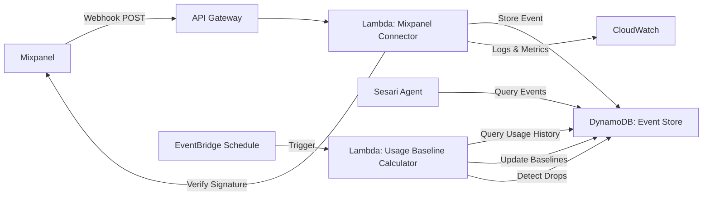

# Design Document: Behavioral Senses Mixpanel

## Overview

Behavioral Senses is a real-time Mixpanel monitoring system that detects critical product usage signals for B2B SaaS businesses. The system processes Mixpanel webhook events through serverless Lambda functions, extracting feature adoption drops and power user patterns to provide the Sesari autonomous growth agent with actionable behavioral intelligence.

The design prioritizes AWS Free Tier compliance, security through webhook signature verification, and reliability through idempotent event processing. All behavioral signals are persisted in DynamoDB for historical analysis and pattern recognition.

## Architecture

### High-Level Architecture



### Component Responsibilities

**Mixpanel Connector Lambda**
- Receives webhook POST requests from Mixpanel via API Gateway
- Verifies webhook signatures using Mixpanel signing secret
- Parses webhook payloads and extracts behavioral signals
- Implements idempotent processing using Mixpanel event IDs
- Stores processed events in DynamoDB
- Returns appropriate HTTP status codes for Mixpanel retry logic

**Usage Baseline Calculator Lambda**
- Triggered by EventBridge on a daily schedule
- Queries DynamoDB for rolling 30-day usage history per user-feature combination
- Calculates average usage frequency baselines
- Detects feature adoption drops by comparing current usage to baselines
- Identifies power users based on engagement scores and activity frequency
- Stores baseline data and behavioral signal events in DynamoDB

**DynamoDB Event Store**
- Persists all behavioral signal events (feature adoption drops, power user identifications)
- Stores usage baselines for each user-feature combination
- Provides indexed access by user ID and timestamp
- Enforces uniqueness constraints on Mixpanel event IDs
- Retains events for 90+ days for trend analysis

**API Gateway**
- Exposes HTTPS endpoint for Mixpanel webhooks
- Routes requests to Lambda function
- Handles request/response transformation

### Technology Choices

**AWS Lambda**: Serverless compute eliminates always-on costs and scales automatically with webhook volume. Execution time optimized to stay within 1 million monthly free tier invocations.

**DynamoDB**: Serverless NoSQL database with on-demand pricing scales to zero when idle. Provides fast indexed queries for user-based event retrieval and usage baseline storage.

**API Gateway**: Managed HTTPS endpoint with automatic SSL certificate management. Free tier includes 1 million API calls per month.

**EventBridge**: Scheduled triggers for daily usage baseline calculation and drop detection. Free tier includes 1 million events per month.

**Mixpanel SDK**: Official Node.js SDK for webhook signature verification. Minimal dependency footprint.

## Components and Interfaces

### Mixpanel Connector Lambda

**Entry Point**: `packages/lambdas/mixpanel-connector/src/index.ts`

**Handler Function**
```typescript
export async function handler(event: APIGatewayProxyEvent): Promise<APIGatewayProxyResult>
```

**Input**: API Gateway proxy event containing Mixpanel webhook payload and headers
**Output**: HTTP response with status code and optional body

**Key Functions**

```typescript
/**
 * Verifies Mixpanel webhook signature to ensure authenticity
 */
function verifyWebhookSignature(
  payload: string,
  signature: string,
  secret: string,
  timestamp: string
): boolean

/**
 * Checks if event has already been processed (idempotency)
 */
async function isEventProcessed(eventId: string): Promise<boolean>

/**
 * Extracts behavioral signal from Mixpanel event based on type
 */
function extractBehavioralSignal(mixpanelEvent: MixpanelEvent): BehavioralSignal | null

/**
 * Stores behavioral signal in DynamoDB Event Store
 */
async function storeBehavioralSignal(signal: BehavioralSignal): Promise<void>

/**
 * Stores raw usage event for baseline calculation
 */
async function storeUsageEvent(event: UsageEvent): Promise<void>
```

### Usage Baseline Calculator Lambda

**Entry Point**: `packages/lambdas/mixpanel-connector/src/baseline-calculator.ts`

**Handler Function**
```typescript
export async function handler(event: EventBridgeEvent): Promise<void>
```

**Key Functions**

```typescript
/**
 * Retrieves all unique user-feature combinations from recent usage
 */
async function getUserFeatureCombinations(): Promise<Array<{userId: string, feature: string}>>

/**
 * Calculates rolling 30-day usage frequency for a user-feature combination
 */
async function calculateUsageBaseline(
  userId: string,
  feature: string
): Promise<UsageBaseline>

/**
 * Detects feature adoption drop by comparing current usage to baseline
 */
function detectAdoptionDrop(
  currentUsage: number,
  baseline: number,
  daysSinceLastUse: number
): FeatureAdoptionDrop | null

/**
 * Calculates engagement score based on event frequency and feature diversity
 */
function calculateEngagementScore(
  userId: string,
  usageHistory: UsageEvent[]
): number

/**
 * Identifies power users based on activity frequency and engagement score
 */
async function identifyPowerUsers(): Promise<PowerUserEvent[]>

/**
 * Stores usage baseline in DynamoDB with 90-day TTL
 */
async function storeUsageBaseline(baseline: UsageBaseline): Promise<void>
```

### Event Store Interface

**DynamoDB Tables**

**Table 1**: `behavioral-signals`
- **Primary Key**: `eventId` (Mixpanel event ID - ensures uniqueness)
- **GSI**: `userId-timestamp-index` (enables user-based queries)

**Table 2**: `usage-baselines`
- **Primary Key**: `userId#feature` (composite key)
- **Attributes**: `averageFrequency`, `lastCalculated`, `expiresAt` (TTL)

**Access Functions**

```typescript
/**
 * Stores a behavioral signal event in DynamoDB
 */
async function putEvent(event: BehavioralSignalEvent): Promise<void>

/**
 * Checks if an event ID already exists
 */
async function eventExists(eventId: string): Promise<boolean>

/**
 * Retrieves events for a specific user within a date range
 */
async function queryEventsByUser(
  userId: string,
  startDate: Date,
  endDate: Date
): Promise<BehavioralSignalEvent[]>

/**
 * Retrieves events by type within a date range
 */
async function queryEventsByType(
  eventType: 'feature_adoption_drop' | 'power_user',
  startDate: Date,
  endDate: Date
): Promise<BehavioralSignalEvent[]>

/**
 * Retrieves events by feature within a date range
 */
async function queryEventsByFeature(
  feature: string,
  startDate: Date,
  endDate: Date
): Promise<BehavioralSignalEvent[]>

/**
 * Retrieves usage baseline for a user-feature combination
 */
async function getUsageBaseline(
  userId: string,
  feature: string
): Promise<UsageBaseline | null>

/**
 * Retrieves usage history for a user-feature combination
 */
async function getUsageHistory(
  userId: string,
  feature: string,
  days: number
): Promise<UsageEvent[]>
```

### Configuration Management

**Environment Variables**
- `MIXPANEL_WEBHOOK_SECRET`: Webhook signing secret for signature verification
- `DYNAMODB_SIGNALS_TABLE`: Name of the behavioral signals DynamoDB table
- `DYNAMODB_BASELINES_TABLE`: Name of the usage baselines DynamoDB table
- `AWS_REGION`: AWS region for DynamoDB client
- `LOG_LEVEL`: Logging verbosity (info, warn, error)
- `ADOPTION_DROP_THRESHOLD`: Percentage drop to trigger alert (default: 50)
- `INACTIVITY_THRESHOLD_DAYS`: Days of inactivity to trigger alert (default: 14)
- `POWER_USER_DAYS_THRESHOLD`: Days active in 30-day period (default: 20)
- `POWER_USER_PERCENTILE`: Engagement score percentile (default: 90)

**Secrets Management**: Webhook signing secret retrieved from environment variables (set via Lambda configuration from AWS Secrets Manager or SSM Parameter Store during deployment).

## Data Models

### BehavioralSignalEvent (DynamoDB Schema)

```typescript
interface BehavioralSignalEvent {
  // Primary Key
  eventId: string;              // Mixpanel event ID or generated ID for calculated events
  
  // Event Classification
  eventType: 'feature_adoption_drop' | 'power_user';
  
  // User Information
  userId: string;               // Mixpanel distinct_id
  
  // Temporal Data
  timestamp: number;            // Unix timestamp (seconds)
  processedAt: number;          // When event was processed by Lambda
  
  // Event-Specific Details
  details: FeatureAdoptionDropDetails | PowerUserDetails;
  
  // Metadata
  mixpanelEventType?: string;   // Original Mixpanel event type (if webhook-driven)
  rawPayload?: string;          // Optional: full Mixpanel event for debugging
}
```

### FeatureAdoptionDropDetails

```typescript
interface FeatureAdoptionDropDetails {
  feature: string;              // Feature name
  previousUsageFrequency: number; // Average uses per day in baseline period
  currentUsageFrequency: number;  // Current uses per day
  dropPercentage: number;       // Percentage decrease
  daysSinceLastUse: number;     // Days since last feature interaction
  baselinePeriodDays: number;   // Days used for baseline calculation (typically 30)
  detectionReason: 'percentage_drop' | 'inactivity' | 'both';
}
```

### PowerUserDetails

```typescript
interface PowerUserDetails {
  engagementScore: number;      // Calculated engagement metric
  daysActiveInLast30: number;   // Days with at least one event
  mostUsedFeatures: Array<{
    feature: string;
    usageCount: number;
  }>;                           // Top 5 features by usage
  totalEventsLast30Days: number; // Total event count
  featureDiversity: number;     // Number of distinct features used
  percentileRank: number;       // User's percentile among all active users
}
```

### UsageBaseline (DynamoDB Schema)

```typescript
interface UsageBaseline {
  // Primary Key
  userFeatureKey: string;       // Format: "userId#feature"
  
  // Baseline Data
  userId: string;
  feature: string;
  averageFrequency: number;     // Average uses per day over 30-day window
  totalUses: number;            // Total uses in baseline period
  baselinePeriodDays: number;   // Days of data used (7-30)
  lastCalculated: number;       // Unix timestamp of last calculation
  
  // TTL
  expiresAt: number;            // Unix timestamp (90 days from lastCalculated)
}
```

### UsageEvent (DynamoDB Schema)

```typescript
interface UsageEvent {
  // Primary Key
  eventId: string;              // Mixpanel event ID
  
  // Event Data
  userId: string;               // Mixpanel distinct_id
  feature: string;              // Feature name extracted from event
  eventName: string;            // Mixpanel event name
  timestamp: number;            // Unix timestamp (seconds)
  properties: Record<string, any>; // Event properties
  
  // TTL
  expiresAt: number;            // Unix timestamp (90 days from timestamp)
}
```

### Mixpanel Event Type Mapping

**Feature Usage Events**
- User activity events (e.g., "Feature Used", "Button Clicked", "Page Viewed")
- Tracked for baseline calculation and adoption monitoring

**Engagement Summary Events**
- Aggregated engagement metrics from Mixpanel
- Used for power user identification

**Filtered Events**
- System events (e.g., "Session Start", "App Opened")
- Non-feature-specific events ignored for behavioral signals


## Correctness Properties

*A property is a characteristic or behavior that should hold true across all valid executions of a system-essentially, a formal statement about what the system should do. Properties serve as the bridge between human-readable specifications and machine-verifiable correctness guarantees.*

### Property 1: Feature Adoption Drop Detection

*For any* user-feature combination with sufficient historical data (7+ days), when usage drops by 50% or more compared to the 30-day average OR when the feature has not been used for 14 consecutive days, the system should create a Feature_Adoption_Drop_Event containing the user ID, feature name, previous usage frequency, current usage frequency, drop percentage, days since last use, and detection reason.

**Validates: Requirements 1.1, 1.2, 1.3**

### Property 2: Usage Baseline Calculation

*For any* user-feature combination, the system should calculate usage baselines using a rolling 30-day window, computing the average usage frequency from all events in that window.

**Validates: Requirements 1.4, 10.1, 10.2**

### Property 3: Insufficient Data Handling

*For any* user-feature combination with less than 7 days of historical data, the system should skip drop detection and not create a Feature_Adoption_Drop_Event.

**Validates: Requirements 10.3**

### Property 4: Power User Detection

*For any* user who logs product events on 20 or more days within a 30-day period OR whose engagement score exceeds the 90th percentile of all active users, the system should create a Power_User_Event containing the user ID, engagement score, days active in last 30 days, most used features (top 5), total events, feature diversity, and percentile rank.

**Validates: Requirements 2.1, 2.2, 2.3**

### Property 5: Engagement Score Calculation

*For any* user, the engagement score should be calculated based on both event frequency (total events in 30 days) and feature diversity (number of distinct features used), with higher values for both dimensions resulting in higher scores.

**Validates: Requirements 2.4**

### Property 6: Webhook Signature Verification

*For any* incoming webhook request, the system should verify the Mixpanel signature using the webhook signing secret and the request timestamp, only processing requests with valid signatures and timestamps within the last 5 minutes.

**Validates: Requirements 3.1, 3.3**

### Property 7: Invalid Signature Rejection

*For any* webhook request with an invalid signature OR a timestamp older than 5 minutes, the system should return a 401 status code, log a security violation with the request source IP address, and not process the event.

**Validates: Requirements 3.2, 3.3, 3.5**

### Property 8: Event Persistence

*For any* valid behavioral signal event (feature adoption drop or power user), the system should successfully persist the event to DynamoDB with all required fields and a TTL set to 90 days from the event timestamp.

**Validates: Requirements 4.1, 4.4**

### Property 9: Event Query by Filters

*For any* combination of event type, user ID, feature name, and date range, querying the Event Store should return only events matching all specified criteria, ordered by timestamp.

**Validates: Requirements 4.5**

### Property 10: Idempotent Event Processing

*For any* Mixpanel event ID that has already been processed, receiving a duplicate webhook with the same event ID should return a 200 status code, log the duplicate attempt, and not create a duplicate event in the Event Store.

**Validates: Requirements 5.1, 5.5**

### Property 11: Event ID Uniqueness Enforcement

*For any* attempt to store an event with a duplicate Mixpanel event ID, the Event Store should enforce uniqueness through the primary key constraint and prevent duplicate storage.

**Validates: Requirements 5.4**

### Property 12: Database Unavailability Error Handling

*For any* webhook processing attempt when DynamoDB is unavailable, the system should return a 500 status code to trigger Mixpanel's retry mechanism and log the error with full context.

**Validates: Requirements 6.1, 6.2**

### Property 13: Malformed Payload Handling

*For any* webhook request with a payload that cannot be parsed as valid JSON or is missing required fields, the system should log the raw payload, return a 400 status code, and not process the event.

**Validates: Requirements 6.4**

### Property 14: Webhook Processing Logging

*For any* processed webhook (successful or failed), the system should log an entry containing the Mixpanel event ID, event type, processing duration, and outcome, with the event ID included in all related log entries for traceability.

**Validates: Requirements 8.1, 8.4**

### Property 15: Metrics Emission

*For any* webhook processing attempt, the system should emit CloudWatch metrics indicating success or failure, processing latency, and event type.

**Validates: Requirements 8.2**

### Property 16: Error Context Logging

*For any* processing failure, the system should log the error with sufficient context including event ID, event type, error message, and stack trace for debugging.

**Validates: Requirements 8.3**

### Property 17: Event Type Filtering

*For any* Mixpanel webhook event, the system should process user activity events and engagement summary events for behavioral signal extraction, ignore non-behavioral events with a 200 status code, and log all ignored event types for monitoring.

**Validates: Requirements 9.1, 9.2, 9.3, 9.4**

### Property 18: Batch Event Processing

*For any* webhook payload containing multiple Mixpanel events, the system should process all events in the batch, creating appropriate behavioral signals for each relevant event.

**Validates: Requirements 9.5**

### Property 19: Usage Baseline TTL

*For any* usage baseline stored in DynamoDB, the system should set the TTL (expiresAt) attribute to 90 days from the last calculation timestamp to enable automatic expiration.

**Validates: Requirements 10.5**

## Error Handling

### Webhook Signature Verification Errors

**Invalid Signature**
- Return HTTP 401 Unauthorized
- Log security violation with source IP
- Do not process the webhook
- Mixpanel will not retry (authentication failure)

**Expired Timestamp (>5 minutes old)**
- Return HTTP 401 Unauthorized
- Log replay attack attempt with timestamp details
- Do not process the webhook

### Parsing Errors

**Malformed JSON Payload**
- Return HTTP 400 Bad Request
- Log raw payload for debugging (truncated if >1KB)
- Mixpanel will not retry (client error)

**Missing Required Fields**
- Return HTTP 400 Bad Request
- Log validation error with missing field names
- Mixpanel will not retry

**Invalid Event Structure**
- Return HTTP 400 Bad Request
- Log structural validation error
- Mixpanel will not retry

### Database Errors

**DynamoDB Unavailable**
- Return HTTP 500 Internal Server Error
- Log error with full context
- Mixpanel will retry with exponential backoff

**Write Throttling**
- Implement exponential backoff (3 retries: 100ms, 200ms, 400ms)
- If all retries fail, return HTTP 500
- Log throttling event for capacity planning

**Conditional Check Failed (duplicate event ID)**
- Return HTTP 200 OK (idempotent success)
- Log duplicate attempt with event ID
- Do not create duplicate event

### Lambda Execution Errors

**Timeout (approaching 10 seconds)**
- Log warning at 8 seconds with current processing state
- Return HTTP 500 if timeout occurs
- Mixpanel will retry

**Out of Memory**
- Log error with memory usage statistics
- Return HTTP 500
- Mixpanel will retry

**Unhandled Exception**
- Catch all exceptions at handler level
- Log full error details and stack trace
- Return HTTP 500
- Mixpanel will retry

### Baseline Calculator Errors

**Insufficient Data**
- Skip drop detection for that user-feature combination
- Log informational message (not an error)
- Continue processing other combinations

**Query Timeout**
- Log error with query details
- Skip current calculation cycle
- Will retry on next scheduled run

**Calculation Error**
- Log error with user-feature combination
- Skip that combination
- Continue processing others

### Error Response Format

All error responses follow this structure:

```typescript
{
  statusCode: number,
  body: JSON.stringify({
    error: string,        // Error type
    message: string,      // Human-readable message
    eventId?: string      // Mixpanel event ID if available
  })
}
```

### Retry Strategy

**Mixpanel's Retry Behavior**
- Mixpanel retries webhooks that return 5xx status codes
- Exponential backoff with maximum retry attempts
- 4xx status codes are not retried (client errors)

**Lambda Retry Configuration**
- DynamoDB writes: 3 retries with exponential backoff (100ms, 200ms, 400ms)
- No retries for signature verification (fail fast)
- No retries for parsing errors (fail fast)

**Baseline Calculator Retry**
- Scheduled daily via EventBridge
- Individual user-feature failures do not block batch processing
- Failed calculations logged for manual review

## Testing Strategy

### Dual Testing Approach

The testing strategy employs both unit tests and property-based tests to ensure comprehensive coverage:

**Unit Tests**: Focus on specific examples, edge cases, and integration points between components. Unit tests verify concrete scenarios like handling a specific Mixpanel event payload, testing error responses for known failure conditions, or verifying baseline calculation with a known dataset.

**Property-Based Tests**: Verify universal properties across all inputs through randomized testing. Each property test runs a minimum of 100 iterations with randomly generated inputs to catch edge cases that might be missed by example-based tests.

Together, these approaches provide complementary coverage: unit tests catch concrete bugs in specific scenarios, while property tests verify general correctness across the input space.

### Property-Based Testing Configuration

**Framework**: Use `fast-check` for TypeScript/Node.js property-based testing

**Test Configuration**
- Minimum 100 iterations per property test
- Each test references its design document property
- Tag format: `Feature: behavioral-senses-mixpanel, Property {number}: {property_text}`

**Example Property Test Structure**

```typescript
import fc from 'fast-check';

describe('Feature: behavioral-senses-mixpanel, Property 1: Feature Adoption Drop Detection', () => {
  it('should create Feature_Adoption_Drop_Event for any 50%+ usage drop', () => {
    fc.assert(
      fc.property(
        fc.record({
          userId: fc.string(),
          feature: fc.string(),
          baselineUsage: fc.integer({ min: 10, max: 100 }),
          currentUsage: fc.integer({ min: 0, max: 49 }),
          daysSinceLastUse: fc.integer({ min: 0, max: 13 })
        }),
        (usageData) => {
          const dropPercentage = 
            ((usageData.baselineUsage - usageData.currentUsage) / usageData.baselineUsage) * 100;
          
          if (dropPercentage >= 50) {
            const event = detectAdoptionDrop(
              usageData.userId,
              usageData.feature,
              usageData.baselineUsage,
              usageData.currentUsage,
              usageData.daysSinceLastUse
            );
            
            expect(event).toBeDefined();
            expect(event.eventType).toBe('feature_adoption_drop');
            expect(event.userId).toBe(usageData.userId);
            expect(event.details.feature).toBe(usageData.feature);
            expect(event.details.dropPercentage).toBeGreaterThanOrEqual(50);
            expect(event.details.previousUsageFrequency).toBe(usageData.baselineUsage);
            expect(event.details.currentUsageFrequency).toBe(usageData.currentUsage);
          }
        }
      ),
      { numRuns: 100 }
    );
  });
  
  it('should create Feature_Adoption_Drop_Event for 14+ days of inactivity', () => {
    fc.assert(
      fc.property(
        fc.record({
          userId: fc.string(),
          feature: fc.string(),
          baselineUsage: fc.integer({ min: 1, max: 100 }),
          daysSinceLastUse: fc.integer({ min: 14, max: 90 })
        }),
        (usageData) => {
          const event = detectAdoptionDrop(
            usageData.userId,
            usageData.feature,
            usageData.baselineUsage,
            0,
            usageData.daysSinceLastUse
          );
          
          expect(event).toBeDefined();
          expect(event.eventType).toBe('feature_adoption_drop');
          expect(event.details.daysSinceLastUse).toBeGreaterThanOrEqual(14);
          expect(event.details.detectionReason).toMatch(/inactivity/);
        }
      ),
      { numRuns: 100 }
    );
  });
});
```

### Unit Testing Focus Areas

**Specific Examples**
- Test processing a real Mixpanel webhook payload from documentation
- Test baseline calculation with known usage data (e.g., 30 events over 30 days = 1.0 avg)
- Test power user detection with a user active 25 days in last 30
- Test engagement score calculation with specific frequency and diversity values

**Edge Cases**
- Empty webhook payload
- Webhook with missing user ID
- Usage baseline with exactly 7 days of data (minimum threshold)
- User with exactly 20 days active (power user threshold boundary)
- Feature adoption drop of exactly 50% (threshold boundary)
- Webhook timestamp exactly at 5-minute boundary
- Batch webhook with mix of valid and invalid events

**Integration Points**
- DynamoDB connection and error handling
- Mixpanel SDK signature verification
- CloudWatch logging and metrics emission
- Environment variable configuration
- EventBridge scheduled trigger handling

**Error Conditions**
- Invalid signature verification
- DynamoDB throttling
- Lambda timeout scenarios
- Malformed JSON payloads
- Missing required environment variables

### Test Coverage Requirements

**Minimum Coverage Targets**
- Line coverage: 90%
- Branch coverage: 85%
- Function coverage: 100%

**Critical Paths (100% coverage required)**
- Webhook signature verification
- Event ID deduplication logic
- Behavioral signal extraction
- Baseline calculation logic
- Drop detection logic
- Power user identification logic
- Error handling and status code returns

### Testing Tools

**Unit Testing**: Vitest with TypeScript support
**Property Testing**: fast-check
**Mocking**: AWS SDK mocks for DynamoDB
**Integration Testing**: LocalStack for local AWS service testing

### Continuous Integration

All tests must pass before deployment:
- Unit tests run on every commit
- Property tests run on every pull request
- Integration tests run before production deployment
- Coverage reports generated and tracked over time

## AWS Free Tier Optimization

### Lambda Configuration

**Mixpanel Connector Lambda**
- Memory: 512 MB (balance between cost and performance)
- Timeout: 10 seconds (sufficient for webhook processing)
- Concurrency: No reserved concurrency (use on-demand)

**Usage Baseline Calculator Lambda**
- Memory: 1024 MB (needs more memory for batch calculations)
- Timeout: 5 minutes (batch processing of user-feature combinations)
- Concurrency: 1 (prevent overlapping runs)

### Cost Optimization Strategies

**Webhook Processing**
- Minimize cold start time with small dependency footprint
- Process only relevant event types (filter early)
- Use efficient DynamoDB queries with GSI
- Batch write operations when possible

**Baseline Calculator**
- Run once daily (not hourly) to minimize invocations
- Batch process user-feature combinations to reduce queries
- Use DynamoDB query pagination efficiently
- Limit processing to active users (events in last 30 days)

**DynamoDB**
- Use on-demand pricing (no provisioned capacity)
- Implement efficient query patterns with GSI
- Set TTL for automatic event expiration after 90 days
- Use composite keys to minimize storage

### Cost Estimates (Free Tier)

**Lambda Invocations**
- Webhook processing: ~2000 webhooks/month = well within 1M free tier
- Baseline calculator: 30 runs/month = negligible

**DynamoDB**
- Storage: ~2GB for 90 days of events and baselines = within 25GB free tier
- Reads/Writes: ~20k operations/month = within free tier

**API Gateway**
- Requests: ~2000/month = well within 1M free tier

**Expected monthly cost**: <$1 for typical usage

## Deployment Architecture

### Infrastructure Components

**API Gateway**
- REST API with POST endpoint `/mixpanel-webhook`
- Integration with Mixpanel Connector Lambda
- Request validation and transformation

**Lambda Functions**
- `mixpanel-connector`: Webhook processing and usage event storage
- `usage-baseline-calculator`: Scheduled baseline calculation and signal detection

**DynamoDB Tables**
- Table 1: `behavioral-signals`
  - Primary key: `eventId` (String)
  - GSI: `userId-timestamp-index`
  - TTL attribute: `expiresAt` (90 days)
- Table 2: `usage-baselines`
  - Primary key: `userFeatureKey` (String, format: "userId#feature")
  - TTL attribute: `expiresAt` (90 days)

**EventBridge Rule**
- Schedule: `cron(0 10 * * ? *)` (daily at 10 AM UTC)
- Target: Usage Baseline Calculator Lambda

**IAM Roles**
- Lambda execution role with DynamoDB read/write permissions
- CloudWatch Logs permissions
- Secrets Manager read permissions (for webhook secret)

### Environment Configuration

**Secrets Management**
- Store `MIXPANEL_WEBHOOK_SECRET` in AWS Secrets Manager
- Lambda retrieves secret at startup (cached for container lifetime)

**Configuration Parameters**
- Store thresholds in SSM Parameter Store
- Allow runtime configuration without redeployment
- Parameters: `ADOPTION_DROP_THRESHOLD`, `INACTIVITY_THRESHOLD_DAYS`, `POWER_USER_DAYS_THRESHOLD`, `POWER_USER_PERCENTILE`

### Monitoring and Alerting

**CloudWatch Alarms**
- Lambda error rate > 5%
- Lambda duration > 8 seconds
- DynamoDB throttling events
- Signature verification failures > 10/hour
- Baseline calculator failures

**CloudWatch Dashboards**
- Webhook processing metrics
- Baseline calculation metrics
- Event type distribution
- Processing latency trends
- Drop detection frequency
- Power user identification frequency

**Log Aggregation**
- Structured JSON logging
- Correlation IDs for request tracing
- Log retention: 30 days
- Log groups: `/aws/lambda/mixpanel-connector`, `/aws/lambda/usage-baseline-calculator`
