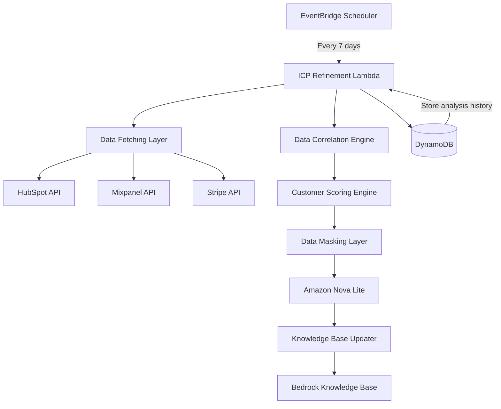

# Design Document: Dynamic ICP Refinement Engine

## Overview

The Dynamic ICP Refinement Engine is an autonomous reasoning system that continuously analyzes customer data from multiple sources (HubSpot, Mixpanel, Stripe) to identify high-value customer traits and automatically update Sesari's Ideal Customer Profile (ICP). This engine runs on a 7-day cycle, correlating LTV, product engagement, and retention signals to surface actionable insights about which customer segments drive the most value.

The system operates as a scheduled Lambda function triggered by EventBridge, processes customer data through a privacy-preserving pipeline, uses Amazon Nova Lite for trait analysis, and updates the Bedrock Knowledge Base with refined ICP profiles that inform future growth plays.

## Architecture

### System Components



### Data Flow

1. **Trigger**: EventBridge fires every 7 days
2. **Fetch**: Retrieve customer data from HubSpot, Mixpanel, Stripe
3. **Correlate**: Join records across platforms using company identifiers
4. **Score**: Calculate Ideal Customer Score for each company
5. **Filter**: Select top 10% of customers by score
6. **Mask**: Strip PII (emails, names) from customer records
7. **Analyze**: Use Nova Lite to identify common traits
8. **Update**: Write new ICP profile to Knowledge Base
9. **Store**: Save analysis results and reasoning to DynamoDB

### AWS Free Tier Compliance

- **Lambda**: Single function, runs 4 times/month (well within 1M free requests)
- **EventBridge**: 4 scheduled events/month (within free tier)
- **DynamoDB**: On-demand pricing, minimal storage for analysis history
- **Bedrock**: Nova Lite model for cost-effective reasoning
- **API Calls**: Batch processing to minimize Lambda execution time

## Components and Interfaces

### 1. EventBridge Scheduler

**Purpose**: Trigger ICP refinement on a 7-day cycle

**Configuration**:
```typescript
interface ScheduleConfig {
  name: string;              // "icp-refinement-schedule"
  scheduleExpression: string; // "rate(7 days)"
  targetArn: string;         // Lambda function ARN
  enabled: boolean;
}
```

### 2. Data Fetching Layer

**Purpose**: Retrieve customer data from integrated platforms

**Interfaces**:
```typescript
interface HubSpotCompany {
  companyId: string;
  name: string;
  industry: string;
  employeeCount: number;
  region: string;
  totalRevenue: number;      // LTV from deals
  createdAt: string;
  properties: Record<string, any>;
}

interface MixpanelCohort {
  companyId: string;
  ahaEventCount: number;     // Frequency of 'Aha! Moment' events
  retentionRate: number;     // 30-day retention percentage
  lastActiveDate: string;
  engagementScore: number;
}

interface StripeCustomer {
  customerId: string;
  companyId: string;
  hasChurnSignal: boolean;   // Subscription cancelled or payment failed
  mrr: number;
  subscriptionStatus: string;
}
```

**Functions**:
```typescript
async function fetchHubSpotCompanies(limit: number): Promise<HubSpotCompany[]>
async function fetchMixpanelCohorts(companyIds: string[]): Promise<MixpanelCohort[]>
async function fetchStripeCustomers(companyIds: string[]): Promise<StripeCustomer[]>
```

### 3. Data Correlation Engine

**Purpose**: Join customer records across platforms using company identifiers

**Interface**:
```typescript
interface CorrelatedCustomer {
  companyId: string;
  hubspot: HubSpotCompany;
  mixpanel: MixpanelCohort | null;
  stripe: StripeCustomer | null;
}
```

**Function**:
```typescript
function correlateCustomerData(
  hubspotCompanies: HubSpotCompany[],
  mixpanelCohorts: MixpanelCohort[],
  stripeCustomers: StripeCustomer[]
): CorrelatedCustomer[]
```

**Correlation Logic**:
- Primary key: `companyId` (must exist in HubSpot)
- Left join: Mixpanel and Stripe data optional
- Handle missing data gracefully (null values)

### 4. Customer Scoring Engine

**Purpose**: Calculate Ideal Customer Score based on LTV, engagement, and retention

**Interface**:
```typescript
interface ScoredCustomer extends CorrelatedCustomer {
  idealCustomerScore: number; // 0-100 composite score
  scoreBreakdown: {
    ltvScore: number;         // 0-100
    engagementScore: number;  // 0-100
    retentionScore: number;   // 0-100
  };
}
```

**Scoring Formula**:
```typescript
function calculateIdealCustomerScore(customer: CorrelatedCustomer): number {
  const ltvScore = normalizeLTV(customer.hubspot.totalRevenue);
  const engagementScore = normalizeEngagement(customer.mixpanel?.ahaEventCount || 0);
  const retentionScore = calculateRetentionScore(
    customer.mixpanel?.retentionRate || 0,
    customer.stripe?.hasChurnSignal || false
  );
  
  // Weighted average: LTV (40%), Engagement (30%), Retention (30%)
  return (ltvScore * 0.4) + (engagementScore * 0.3) + (retentionScore * 0.3);
}
```

**Normalization Functions**:
- `normalizeLTV`: Map revenue to 0-100 scale using percentile ranking
- `normalizeEngagement`: Map event frequency to 0-100 scale
- `calculateRetentionScore`: Combine retention rate with churn signal penalty

### 5. Data Masking Layer

**Purpose**: Strip PII before sending data to LLM for analysis

**Interface**:
```typescript
interface MaskedCustomer {
  companyId: string;         // Keep for grouping
  industry: string;
  employeeCount: number;
  region: string;
  ltvBucket: string;         // "High", "Medium", "Low"
  engagementBucket: string;
  retentionBucket: string;
  idealCustomerScore: number;
}
```

**Masking Rules**:
- Remove: company name, contact emails, personal identifiers
- Keep: industry, size, region, aggregated metrics
- Bucket: Convert exact values to ranges for privacy

**Function**:
```typescript
function maskCustomerData(customers: ScoredCustomer[]): MaskedCustomer[]
```

### 6. Trait Analysis Engine (Nova Lite)

**Purpose**: Use LLM to identify common traits among top-performing customers

**Input**:
```typescript
interface TraitAnalysisInput {
  topCustomers: MaskedCustomer[];  // Top 10% by score
  previousICP: ICPProfile | null;  // For comparison
}
```

**Output**:
```typescript
interface TraitAnalysisOutput {
  commonTraits: {
    industries: string[];      // Most common industries
    sizeRange: string;         // Employee count range
    regions: string[];         // Geographic concentration
    usagePatterns: string[];   // Behavioral patterns
  };
  reasoning: string;           // Explainability text
  confidenceScore: number;     // 0-100
  changeFromPrevious: string;  // What shifted
}
```

**Prompt Template**:
```
You are analyzing the top 10% of high-value B2B SaaS customers to identify common traits.

Data:
{JSON array of MaskedCustomer objects}

Previous ICP:
{Previous ICP profile if exists}

Task:
1. Identify the most common industries (list top 3)
2. Determine the typical company size range
3. Identify geographic concentration
4. Describe common usage patterns

Provide reasoning for each trait identified. If the ICP has shifted from the previous profile, explain why.

Format your response as JSON matching the TraitAnalysisOutput interface.
```

### 7. Knowledge Base Updater

**Purpose**: Write refined ICP profile to Bedrock Knowledge Base

**Interface**:
```typescript
interface ICPProfile {
  version: number;
  generatedAt: string;
  traits: {
    industries: string[];
    sizeRange: string;
    regions: string[];
    usagePatterns: string[];
  };
  reasoning: string;
  confidenceScore: number;
  sampleSize: number;
}
```

**Function**:
```typescript
async function updateICPProfile(
  profile: ICPProfile,
  knowledgeBaseId: string
): Promise<void>
```

**Storage Format**:
- File: `icp_profile.md` in Knowledge Base
- Markdown format for human readability
- Includes metadata header with version and timestamp
- Reasoning section for explainability

### 8. Analysis History Store (DynamoDB)

**Purpose**: Track ICP evolution over time for trend analysis

**Table Schema**:
```typescript
interface ICPAnalysisRecord {
  analysisId: string;        // PK: ISO timestamp
  version: number;
  profile: ICPProfile;
  topCustomerIds: string[];  // Anonymized IDs
  scoreDistribution: {
    min: number;
    max: number;
    mean: number;
    p90: number;
  };
  executionMetrics: {
    durationMs: number;
    customersAnalyzed: number;
    apiCallCount: number;
  };
}
```

## Data Models

### Core Data Types

```typescript
// Customer identification across platforms
interface CompanyIdentifier {
  hubspotId: string;
  mixpanelId?: string;
  stripeId?: string;
}

// Scoring weights (configurable)
interface ScoringWeights {
  ltv: number;        // Default: 0.4
  engagement: number; // Default: 0.3
  retention: number;  // Default: 0.3
}

// Configuration
interface EngineConfig {
  topPercentile: number;      // Default: 10 (top 10%)
  minSampleSize: number;      // Minimum customers for analysis
  scoringWeights: ScoringWeights;
  knowledgeBaseId: string;
  analysisTableName: string;
}
```

### Data Transformation Pipeline

```
Raw Data → Correlated Data → Scored Data → Masked Data → Traits → ICP Profile
```

## Correctness Properties

A property is a characteristic or behavior that should hold true across all valid executions of a system—essentially, a formal statement about what the system should do. Properties serve as the bridge between human-readable specifications and machine-verifiable correctness guarantees.

### Property 1: Data Correlation Completeness
*For any* set of HubSpot companies, the correlation engine should produce exactly one CorrelatedCustomer record per HubSpot company, regardless of whether Mixpanel or Stripe data exists.
**Validates: Requirements TBD**

### Property 2: Score Normalization Bounds
*For any* customer with valid data, the calculated idealCustomerScore and all component scores (ltvScore, engagementScore, retentionScore) should be within the range [0, 100].
**Validates: Requirements TBD**

### Property 3: Score Weighting Consistency
*For any* customer and any valid scoring weights that sum to 1.0, the calculated idealCustomerScore should equal the weighted sum of component scores.
**Validates: Requirements TBD**

### Property 4: Top Percentile Selection
*For any* list of scored customers and percentile threshold P, selecting the top P% should return exactly ceil(N * P/100) customers, where N is the total count.
**Validates: Requirements TBD**

### Property 5: PII Masking Completeness
*For any* customer record, the masked version should contain no email addresses, personal names, or direct identifiers (verified by regex patterns).
**Validates: Requirements TBD**

### Property 6: ICP Profile Versioning
*For any* sequence of ICP profile updates, version numbers should be strictly monotonically increasing with no gaps or duplicates.
**Validates: Requirements TBD**

### Property 7: Analysis History Persistence
*For any* completed analysis run, querying DynamoDB with the analysis timestamp should return the complete ICPAnalysisRecord with all fields populated.
**Validates: Requirements TBD**

### Property 8: Churn Signal Penalty
*For any* two customers with identical LTV and engagement scores, the customer with a churn signal should have a strictly lower idealCustomerScore than the customer without a churn signal.
**Validates: Requirements TBD**

### Property 9: Empty Data Handling
*For any* customer with missing Mixpanel or Stripe data (null values), the scoring engine should calculate a valid score using default values without throwing errors.
**Validates: Requirements TBD**

### Property 10: Trait Analysis Determinism
*For any* identical set of masked customers analyzed twice, the Nova Lite analysis should produce trait lists with the same semantic content (allowing for minor wording variations).
**Validates: Requirements TBD**

## Error Handling

### API Failure Scenarios

**HubSpot API Failure**:
- Retry with exponential backoff (3 attempts)
- If all retries fail, abort analysis and log error
- Do not proceed with partial data

**Mixpanel/Stripe API Failure**:
- Log warning but continue with available data
- Mark affected customers with null values
- Include data completeness metric in analysis record

**Rate Limiting**:
- Implement batch processing with delays between batches
- HubSpot: 100 companies per batch, 1-second delay
- Mixpanel: 50 companies per batch, 500ms delay
- Stripe: 100 customers per batch, 1-second delay

### Data Quality Issues

**Missing Company IDs**:
- Skip records without valid companyId
- Log count of skipped records
- Require minimum sample size (default: 20 customers)

**Invalid Score Calculations**:
- If normalization produces NaN or Infinity, set score to 0
- Log warning with customer ID
- Continue processing other customers

**Insufficient Sample Size**:
- If fewer than minSampleSize customers after filtering, abort analysis
- Return error response with diagnostic information
- Do not update Knowledge Base with unreliable data

### LLM Analysis Failures

**Nova Lite API Error**:
- Retry once after 5-second delay
- If retry fails, use fallback heuristic analysis
- Log that LLM analysis was unavailable

**Invalid JSON Response**:
- Attempt to parse with lenient parser
- If parsing fails, use previous ICP profile
- Log error and mark analysis as degraded

**Low Confidence Score**:
- If Nova returns confidence < 50, flag analysis as uncertain
- Still update Knowledge Base but include confidence warning
- Notify via CloudWatch metric

### Knowledge Base Update Failures

**Bedrock API Error**:
- Retry with exponential backoff (3 attempts)
- If all retries fail, store pending update in DynamoDB
- Trigger alert for manual intervention

**DynamoDB Write Failure**:
- Retry once
- If retry fails, log error but consider analysis complete
- History storage is non-critical to core function

## Testing Strategy

### Dual Testing Approach

This feature requires both unit tests and property-based tests for comprehensive coverage:

- **Unit tests**: Verify specific examples, edge cases, and error conditions
- **Property tests**: Verify universal properties across all inputs
- Both are complementary and necessary

### Unit Testing Focus

Unit tests should cover:
- Specific examples of score calculations with known inputs/outputs
- Edge cases: empty data, missing fields, extreme values
- Error conditions: API failures, invalid responses, timeout scenarios
- Integration points: API client behavior, DynamoDB operations
- Data masking: Verify specific PII patterns are removed

Avoid writing excessive unit tests for scenarios better covered by property tests (e.g., testing score calculations with many different input combinations).

### Property-Based Testing

**Library**: Use `fast-check` for TypeScript/Node.js property-based testing

**Configuration**:
- Minimum 100 iterations per property test
- Each test must reference its design document property
- Tag format: `Feature: dynamic-icp-refinement-engine, Property {number}: {property_text}`

**Property Test Coverage**:
- Property 1: Data correlation completeness
- Property 2: Score normalization bounds
- Property 3: Score weighting consistency
- Property 4: Top percentile selection accuracy
- Property 5: PII masking completeness
- Property 6: ICP profile versioning
- Property 7: Analysis history persistence
- Property 8: Churn signal penalty
- Property 9: Empty data handling
- Property 10: Trait analysis determinism (with mocked LLM)

**Test Organization**:
```
/packages/agent/src/icp-refinement/__tests__/
  correlation.property.test.ts
  scoring.property.test.ts
  masking.property.test.ts
  versioning.property.test.ts
  integration.test.ts
```

### Integration Testing

- Mock external APIs (HubSpot, Mixpanel, Stripe, Bedrock)
- Test complete pipeline with synthetic data
- Verify DynamoDB writes
- Test error recovery paths

### Manual Testing Checklist

- Deploy to AWS and verify EventBridge trigger
- Monitor Lambda execution time (must stay under 15 minutes)
- Verify Knowledge Base updates appear in Bedrock console
- Check CloudWatch logs for errors
- Validate ICP profile markdown formatting

## Implementation Notes

### Batch Processing Strategy

To stay within Lambda execution limits and API rate limits:

1. **Fetch in batches**: Process 100 companies at a time
2. **Parallel requests**: Use `Promise.all` for independent API calls
3. **Progress tracking**: Store checkpoint in DynamoDB if processing > 500 companies
4. **Resume capability**: If Lambda times out, resume from last checkpoint

### Privacy Considerations

**Data Masking Requirements**:
- Remove all email addresses (regex: `/[\w\.-]+@[\w\.-]+\.\w+/g`)
- Remove personal names from company names (keep company type only)
- Replace exact revenue with buckets: "<$10K", "$10K-$50K", "$50K-$100K", ">$100K"
- Replace exact employee counts with ranges: "1-10", "11-50", "51-200", "200+"

**Audit Trail**:
- Log which data was masked
- Store original data hashes for verification
- Never log PII in CloudWatch

### Explainability Requirements

Every ICP update must include:
- **Reasoning**: Natural language explanation of trait identification
- **Data Source**: Which signals contributed to the analysis
- **Change Summary**: How the ICP shifted from previous version
- **Confidence**: Numeric confidence score from Nova Lite

**Example Reasoning**:
```
Moving ICP focus to Finance because their 30-day retention is 40% higher than Retail (85% vs 60%). 
Finance companies also show 3x higher engagement with the 'Report Export' feature, indicating 
stronger product-market fit. Sample size: 45 Finance companies vs 120 Retail companies.
```

### Performance Optimization

**Caching Strategy**:
- Cache HubSpot company list for 24 hours (data doesn't change rapidly)
- Cache Mixpanel cohort data for 12 hours
- Stripe data: No caching (real-time churn signals important)

**Lambda Configuration**:
- Memory: 1024 MB (balance between speed and cost)
- Timeout: 15 minutes (maximum for complex analysis)
- Environment variables: API keys, Knowledge Base ID, table names

### Monitoring and Observability

**CloudWatch Metrics**:
- Custom metric: `ICPAnalysisSuccess` (1 for success, 0 for failure)
- Custom metric: `CustomersAnalyzed` (count)
- Custom metric: `AnalysisDurationMs` (execution time)
- Custom metric: `ICPConfidenceScore` (0-100)

**CloudWatch Alarms**:
- Alert if analysis fails 2 consecutive times
- Alert if confidence score < 50
- Alert if sample size < minSampleSize

**Logging Strategy**:
- Log level: INFO for normal operations
- Log level: WARN for degraded operations (missing data, low confidence)
- Log level: ERROR for failures requiring intervention
- Include correlation ID in all logs for tracing

## Dependencies

### External Services
- HubSpot API (Companies, Deals)
- Mixpanel API (Cohorts, Events)
- Stripe API (Customers, Subscriptions)
- Amazon Bedrock (Nova Lite model)
- Amazon Bedrock Knowledge Bases

### AWS Services
- AWS Lambda (compute)
- Amazon EventBridge (scheduling)
- Amazon DynamoDB (state storage)
- AWS CloudWatch (monitoring)
- AWS IAM (permissions)

### NPM Packages
- `@aws-sdk/client-lambda`
- `@aws-sdk/client-dynamodb`
- `@aws-sdk/client-bedrock-runtime`
- `@aws-sdk/client-bedrock-agent-runtime`
- `@aws-sdk/client-eventbridge`
- `axios` (for external API calls)
- `fast-check` (property-based testing)
- `jest` (unit testing)

## Security Considerations

### IAM Permissions

Lambda execution role must have:
- `bedrock:InvokeModel` (Nova Lite)
- `bedrock:Retrieve` (Knowledge Base read)
- `bedrock:UpdateKnowledgeBase` (Knowledge Base write)
- `dynamodb:PutItem`, `dynamodb:GetItem` (analysis history)
- `logs:CreateLogGroup`, `logs:CreateLogStream`, `logs:PutLogEvents`

### API Key Management

- Store API keys in AWS Secrets Manager
- Rotate keys every 90 days
- Use least-privilege access for each integration
- Never log API keys or tokens

### Data Privacy

- All PII masking must occur before LLM analysis
- No customer data stored in CloudWatch logs
- DynamoDB records encrypted at rest
- Compliance with GDPR/CCPA for data retention

## Future Enhancements

- Real-time ICP updates (trigger on significant customer events)
- Multi-dimensional ICP profiles (segment by product tier)
- Predictive churn scoring integrated into ICP
- A/B testing framework for ICP-driven growth plays
