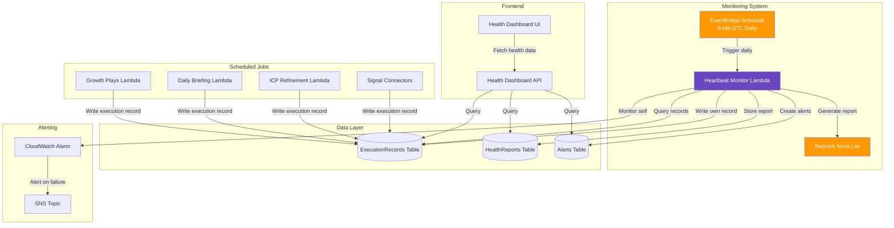

# Design Document: Heartbeat Monitor

## Overview

The Heartbeat Monitor is a self-monitoring system health watchdog that ensures all scheduled processes in Sesari execute correctly. It runs daily via EventBridge, analyzes execution records from all scheduled Lambda functions, detects failures and anomalies, generates AI-powered health reports using Bedrock Nova Lite, and provides a dashboard UI for visibility into system reliability.

### Key Design Goals

1. **Proactive Monitoring**: Detect failures before users notice them
2. **Self-Monitoring**: The monitor itself must be monitored to prevent blind spots
3. **Cost Efficiency**: Stay within AWS Free Tier limits through optimized queries and minimal Lambda execution time
4. **Explainability**: Provide clear, business-friendly explanations of system health
5. **Minimal Overhead**: Scheduled jobs write execution records with negligible performance impact

### Monitored Jobs

The Heartbeat Monitor tracks these critical scheduled processes:

- **Growth Plays Generator** (6 AM UTC daily)
- **Daily Briefing Generator** (8 AM UTC daily)
- **ICP Refinement** (Weekly)
- **Signal Connectors** (Stripe, HubSpot, Mixpanel - various schedules)
- **Heartbeat Monitor itself** (Self-monitoring)

## Architecture

### System Architecture Diagram



### Component Responsibilities

#### 1. Execution Record Writer (Shared Utility)

**Purpose**: Lightweight utility imported by all scheduled Lambda functions to write execution records.

**Responsibilities**:
- Write execution record to DynamoDB after job completion
- Capture execution metadata (duration, status, error details)
- Minimal performance overhead (async write, no blocking)
- Handle DynamoDB write failures gracefully (log but don't fail job)

**Interface**:
```typescript
interface ExecutionRecordWriter {
  writeExecutionRecord(params: {
    jobName: string;
    status: 'success' | 'failure';
    startTime: number;
    endTime: number;
    errorDetails?: string;
    metadata?: Record<string, any>;
  }): Promise<void>;
}
```

#### 2. Heartbeat Monitor Lambda

**Purpose**: Main monitoring orchestrator that runs daily to evaluate system health.

**Responsibilities**:
- Query execution records from past 24 hours
- Detect missing executions, failures, and performance degradation
- Calculate success rates and execution duration trends
- Invoke Bedrock Nova Lite to generate health report
- Create alert records for critical failures
- Write own execution record for self-monitoring

**Execution Flow**:
1. Query all execution records from past 24 hours
2. Group records by job name
3. Evaluate each job against expected execution windows
4. Detect anomalies (missing, failed, degraded)
5. Calculate 7-day success rates
6. Generate health report via Bedrock
7. Store health report and alerts
8. Write own execution record

**Interface**:
```typescript
interface HeartbeatMonitorInput {
  // No input required - runs on schedule
}

interface HeartbeatMonitorOutput {
  healthStatus: 'healthy' | 'degraded' | 'critical';
  jobsEvaluated: number;
  alertsCreated: number;
  reportId: string;
  executionDuration: number;
}
```

#### 3. Health Report Generator

**Purpose**: Uses Bedrock Nova Lite to generate natural language health summaries.

**Responsibilities**:
- Format execution data for Bedrock prompt
- Invoke Bedrock Nova Lite with health data
- Parse and validate generated report
- Ensure report follows consistent structure

**Interface**:
```typescript
interface HealthReportGenerator {
  generateReport(params: {
    jobStatuses: JobHealthStatus[];
    alerts: Alert[];
    timestamp: number;
  }): Promise<HealthReport>;
}
```

#### 4. Health Dashboard API

**Purpose**: Next.js API routes providing health data to the frontend.

**Endpoints**:
- `GET /api/health/status` - Current health status for all jobs
- `GET /api/health/reports?date={YYYY-MM-DD}` - Health report for specific date
- `GET /api/health/history?jobName={name}&limit={n}` - Execution history for a job
- `GET /api/health/alerts` - Active alerts

#### 5. Health Dashboard UI

**Purpose**: React components displaying system health following Sesari UI standards.

**Components**:
- `HealthDashboard` - Main page component
- `HealthOverview` - Overall system status card
- `JobStatusCard` - Individual job health status
- `HealthReportCard` - AI-generated health report display
- `AlertBanner` - Critical failure alerts
- `ExecutionHistoryChart` - Execution duration trends

## Components and Interfaces

### Execution Record Writer

This is a shared utility module that all scheduled Lambda functions import and call after execution.

```typescript
/**
 * Writes execution record to DynamoDB
 * 
 * This function is called by all scheduled Lambda functions to track their execution.
 * It writes asynchronously and handles errors gracefully to avoid impacting the job.
 */
export async function writeExecutionRecord(params: {
  jobName: string;
  status: 'success' | 'failure';
  startTime: number;
  endTime: number;
  errorDetails?: string;
  metadata?: Record<string, any>;
}): Promise<void> {
  const client = new DynamoDBClient({ region: process.env.AWS_REGION });
  
  const record: ExecutionRecord = {
    jobName: params.jobName,
    executionId: generateExecutionId(),
    timestamp: params.endTime,
    status: params.status,
    duration: params.endTime - params.startTime,
    errorDetails: params.errorDetails,
    metadata: params.metadata,
    ttl: calculateTTL(30), // 30-day retention
  };
  
  try {
    await client.send(new PutItemCommand({
      TableName: process.env.EXECUTION_RECORDS_TABLE,
      Item: marshall(record),
    }));
  } catch (error) {
    // Log error but don't throw - we don't want monitoring to break the job
    console.error('Failed to write execution record:', error);
  }
}
```

### Heartbeat Monitor Lambda

Main orchestrator that evaluates system health.

```typescript
/**
 * Heartbeat Monitor Lambda Handler
 * 
 * Runs daily at 9 AM UTC to evaluate system health.
 * Queries execution records, detects anomalies, generates health report.
 */
export async function handler(
  event: EventBridgeEvent
): Promise<HeartbeatMonitorOutput> {
  const startTime = Date.now();
  
  try {
    // 1. Query execution records from past 24 hours
    const records = await queryExecutionRecords(24);
    
    // 2. Evaluate job health
    const jobStatuses = await evaluateJobHealth(records);
    
    // 3. Detect anomalies and create alerts
    const alerts = await detectAnomalies(jobStatuses);
    
    // 4. Generate health report via Bedrock
    const report = await generateHealthReport({
      jobStatuses,
      alerts,
      timestamp: Date.now(),
    });
    
    // 5. Store report and alerts
    await storeHealthReport(report);
    await storeAlerts(alerts);
    
    // 6. Write own execution record
    await writeExecutionRecord({
      jobName: 'heartbeat-monitor',
      status: 'success',
      startTime,
      endTime: Date.now(),
      metadata: {
        jobsEvaluated: jobStatuses.length,
        alertsCreated: alerts.length,
      },
    });
    
    return {
      healthStatus: determineOverallHealth(jobStatuses),
      jobsEvaluated: jobStatuses.length,
      alertsCreated: alerts.length,
      reportId: report.id,
      executionDuration: Date.now() - startTime,
    };
  } catch (error) {
    // Write failure record
    await writeExecutionRecord({
      jobName: 'heartbeat-monitor',
      status: 'failure',
      startTime,
      endTime: Date.now(),
      errorDetails: error.message,
    });
    
    throw error;
  }
}
```

### Job Health Evaluator

Evaluates individual job health based on execution records.

```typescript
/**
 * Evaluates health status for all monitored jobs
 */
async function evaluateJobHealth(
  records: ExecutionRecord[]
): Promise<JobHealthStatus[]> {
  const jobConfigs = getMonitoredJobConfigs();
  const statuses: JobHealthStatus[] = [];
  
  for (const config of jobConfigs) {
    const jobRecords = records.filter(r => r.jobName === config.name);
    
    // Check for missing execution
    if (jobRecords.length === 0) {
      statuses.push({
        jobName: config.name,
        status: 'missing',
        lastExecution: null,
        successRate: 0,
        averageDuration: 0,
      });
      continue;
    }
    
    // Get most recent execution
    const latest = jobRecords.sort((a, b) => b.timestamp - a.timestamp)[0];
    
    // Check for failure
    if (latest.status === 'failure') {
      statuses.push({
        jobName: config.name,
        status: 'failed',
        lastExecution: latest.timestamp,
        errorDetails: latest.errorDetails,
        successRate: calculateSuccessRate(jobRecords),
        averageDuration: calculateAverageDuration(jobRecords),
      });
      continue;
    }
    
    // Check for performance degradation
    const avgDuration = calculateAverageDuration(jobRecords);
    if (latest.duration > avgDuration * 3) {
      statuses.push({
        jobName: config.name,
        status: 'degraded',
        lastExecution: latest.timestamp,
        successRate: calculateSuccessRate(jobRecords),
        averageDuration: avgDuration,
        currentDuration: latest.duration,
      });
      continue;
    }
    
    // Healthy
    statuses.push({
      jobName: config.name,
      status: 'healthy',
      lastExecution: latest.timestamp,
      successRate: calculateSuccessRate(jobRecords),
      averageDuration: avgDuration,
    });
  }
  
  return statuses;
}
```

### Health Report Generator

Generates natural language health reports using Bedrock Nova Lite.

```typescript
/**
 * Generates health report using Bedrock Nova Lite
 */
async function generateHealthReport(params: {
  jobStatuses: JobHealthStatus[];
  alerts: Alert[];
  timestamp: number;
}): Promise<HealthReport> {
  const client = new BedrockRuntimeClient({ region: process.env.AWS_REGION });
  
  const prompt = buildHealthReportPrompt(params);
  
  const response = await client.send(new InvokeModelCommand({
    modelId: 'amazon.nova-lite-v1:0',
    contentType: 'application/json',
    accept: 'application/json',
    body: JSON.stringify({
      messages: [
        {
          role: 'user',
          content: prompt,
        },
      ],
      inferenceConfig: {
        maxTokens: 1000,
        temperature: 0.3,
      },
    }),
  }));
  
  const result = JSON.parse(new TextDecoder().decode(response.body));
  const narrative = result.output.message.content[0].text;
  
  return {
    id: generateReportId(),
    date: new Date(params.timestamp).toISOString().split('T')[0],
    generatedAt: params.timestamp,
    overallStatus: determineOverallHealth(params.jobStatuses),
    narrative,
    jobStatuses: params.jobStatuses,
    alerts: params.alerts,
    metadata: {
      jobsEvaluated: params.jobStatuses.length,
      alertsCreated: params.alerts.length,
    },
  };
}

/**
 * Builds prompt for Bedrock health report generation
 */
function buildHealthReportPrompt(params: {
  jobStatuses: JobHealthStatus[];
  alerts: Alert[];
}): string {
  return `You are a system health analyst for Sesari, an autonomous B2B SaaS growth agent.

Generate a concise daily health report in natural language based on the following system status:

Jobs Evaluated:
${params.jobStatuses.map(j => `- ${j.jobName}: ${j.status} (Success Rate: ${j.successRate}%)`).join('\n')}

Active Alerts:
${params.alerts.length > 0 ? params.alerts.map(a => `- ${a.jobName}: ${a.failureType}`).join('\n') : 'None'}

Provide:
1. Overall system health summary (1-2 sentences)
2. Any critical issues requiring attention
3. Performance trends or observations

Keep the tone professional but conversational. Focus on business impact, not technical jargon.`;
}
```

### Dashboard API Routes

Next.js API routes for the health dashboard.

```typescript
/**
 * GET /api/health/status
 * 
 * Returns current health status for all monitored jobs
 */
export async function GET(request: NextRequest) {
  try {
    const client = new DynamoDBClient({ region: process.env.AWS_REGION });
    
    // Query most recent execution for each job
    const jobConfigs = getMonitoredJobConfigs();
    const statuses = await Promise.all(
      jobConfigs.map(config => getLatestJobStatus(client, config.name))
    );
    
    return NextResponse.json({
      timestamp: Date.now(),
      jobs: statuses,
    });
  } catch (error) {
    console.error('Failed to fetch health status:', error);
    return NextResponse.json(
      { error: 'Failed to fetch health status' },
      { status: 500 }
    );
  }
}
```

```typescript
/**
 * GET /api/health/reports?date={YYYY-MM-DD}
 * 
 * Returns health report for specific date (defaults to today)
 */
export async function GET(request: NextRequest) {
  const { searchParams } = new URL(request.url);
  const date = searchParams.get('date') || getTodayDate();
  
  // Validate date format
  if (!/^\d{4}-\d{2}-\d{2}$/.test(date)) {
    return NextResponse.json(
      { error: 'Invalid date format. Use YYYY-MM-DD' },
      { status: 400 }
    );
  }
  
  try {
    const report = await fetchHealthReport(date);
    
    if (!report) {
      return NextResponse.json(
        { error: 'No health report available for this date' },
        { status: 404 }
      );
    }
    
    return NextResponse.json(report);
  } catch (error) {
    console.error('Failed to fetch health report:', error);
    return NextResponse.json(
      { error: 'Failed to fetch health report' },
      { status: 500 }
    );
  }
}
```

## Data Models

### ExecutionRecord

Tracks individual job executions.

```typescript
interface ExecutionRecord {
  /** Job name (partition key) */
  jobName: string;
  
  /** Unique execution ID (sort key) */
  executionId: string;
  
  /** Unix timestamp when execution completed */
  timestamp: number;
  
  /** Execution status */
  status: 'success' | 'failure';
  
  /** Execution duration in milliseconds */
  duration: number;
  
  /** Error details if failed */
  errorDetails?: string;
  
  /** Additional metadata */
  metadata?: Record<string, any>;
  
  /** TTL for automatic deletion (30 days) */
  ttl: number;
}
```

**DynamoDB Schema**:
- **Table Name**: `ExecutionRecords-{env}`
- **Partition Key**: `jobName` (String)
- **Sort Key**: `executionId` (String)
- **GSI**: `timestamp-index` (for time-based queries)
- **TTL**: `ttl` attribute (30-day retention)

### HealthReport

AI-generated daily health summary.

```typescript
interface HealthReport {
  /** Unique report ID */
  id: string;
  
  /** Date in YYYY-MM-DD format (partition key) */
  date: string;
  
  /** Unix timestamp when report was generated */
  generatedAt: number;
  
  /** Overall system health status */
  overallStatus: 'healthy' | 'degraded' | 'critical';
  
  /** AI-generated narrative summary */
  narrative: string;
  
  /** Job-by-job health status */
  jobStatuses: JobHealthStatus[];
  
  /** Active alerts at time of report */
  alerts: Alert[];
  
  /** Report metadata */
  metadata: {
    jobsEvaluated: number;
    alertsCreated: number;
  };
}
```

**DynamoDB Schema**:
- **Table Name**: `HealthReports-{env}`
- **Partition Key**: `date` (String)
- **Sort Key**: `id` (String)
- **TTL**: 90 days

### JobHealthStatus

Health status for an individual job.

```typescript
interface JobHealthStatus {
  /** Job name */
  jobName: string;
  
  /** Current health status */
  status: 'healthy' | 'degraded' | 'failed' | 'missing';
  
  /** Unix timestamp of last execution (null if missing) */
  lastExecution: number | null;
  
  /** 7-day success rate (0-100) */
  successRate: number;
  
  /** Average execution duration in milliseconds */
  averageDuration: number;
  
  /** Current execution duration (for degraded status) */
  currentDuration?: number;
  
  /** Error details (for failed status) */
  errorDetails?: string;
}
```

### Alert

Critical failure alert.

```typescript
interface Alert {
  /** Unique alert ID */
  id: string;
  
  /** Job name that triggered alert */
  jobName: string;
  
  /** Failure type */
  failureType: 'missing' | 'failed' | 'degraded';
  
  /** Unix timestamp when alert was created */
  createdAt: number;
  
  /** Alert status */
  status: 'active' | 'resolved';
  
  /** Unix timestamp when alert was resolved */
  resolvedAt?: number;
  
  /** Diagnostic information */
  diagnostics: {
    lastSuccessfulExecution?: number;
    errorDetails?: string;
    executionDuration?: number;
  };
}
```

**DynamoDB Schema**:
- **Table Name**: `Alerts-{env}`
- **Partition Key**: `id` (String)
- **GSI**: `status-createdAt-index` (for querying active alerts)
- **TTL**: 90 days

### MonitoredJobConfig

Configuration for jobs being monitored.

```typescript
interface MonitoredJobConfig {
  /** Job name */
  name: string;
  
  /** Job description */
  description: string;
  
  /** Expected execution schedule (cron expression) */
  schedule: string;
  
  /** Whether this is a critical job requiring immediate alerts */
  critical: boolean;
  
  /** Expected execution window in hours */
  executionWindow: number;
  
  /** Expected average duration in milliseconds */
  expectedDuration: number;
}
```

**Hardcoded Configuration**:
```typescript
const MONITORED_JOBS: MonitoredJobConfig[] = [
  {
    name: 'growth-plays-generator',
    description: 'Automated Growth Plays Generator',
    schedule: 'cron(0 6 * * ? *)',
    critical: true,
    executionWindow: 24,
    expectedDuration: 10000,
  },
  {
    name: 'daily-briefing-generator',
    description: 'Daily Briefing Generator',
    schedule: 'cron(0 8 * * ? *)',
    critical: true,
    executionWindow: 24,
    expectedDuration: 8000,
  },
  {
    name: 'stripe-connector',
    description: 'Stripe Signal Connector',
    schedule: 'cron(0 */6 * * ? *)',
    critical: false,
    executionWindow: 6,
    expectedDuration: 5000,
  },
  {
    name: 'hubspot-connector',
    description: 'HubSpot Signal Connector',
    schedule: 'cron(0 */6 * * ? *)',
    critical: false,
    executionWindow: 6,
    expectedDuration: 5000,
  },
  {
    name: 'heartbeat-monitor',
    description: 'Heartbeat Monitor (Self)',
    schedule: 'cron(0 9 * * ? *)',
    critical: true,
    executionWindow: 25,
    expectedDuration: 12000,
  },
];
```


## Correctness Properties

A property is a characteristic or behavior that should hold true across all valid executions of a system—essentially, a formal statement about what the system should do. Properties serve as the bridge between human-readable specifications and machine-verifiable correctness guarantees.

### Property Reflection

After analyzing all acceptance criteria, I identified the following redundancies:

- **2.4 and 6.1** both test alert creation for critical failures - these are the same property
- **2.2 and 9.2** both test failure detection - 9.2 is just a specific case of 2.2
- **4.2, 4.3, and 5.4** all test that the API returns specific data fields - these can be combined into one comprehensive property
- **10.1 and 10.3** both test duration tracking - 10.3 is implied by 10.1

The following properties represent the unique, non-redundant correctness guarantees:

### Property 1: Execution Record Completeness

For any scheduled job execution, the written execution record must contain all required fields: job name, execution timestamp, status, duration, and error details (if status is failure).

**Validates: Requirements 1.1, 1.2**

### Property 2: Time-Based Query Filtering

For any set of execution records with various timestamps, querying for records from the past 24 hours must return only those records where timestamp is within the last 24 hours.

**Validates: Requirements 1.4**

### Property 3: Missing Execution Detection

For any monitored job with an expected execution window, if no execution record exists within that window, the job health evaluator must mark the job as "missing".

**Validates: Requirements 1.5, 2.1**

### Property 4: Failure Status Detection

For any execution record with status "failure", the job health evaluator must mark the corresponding job as "failed".

**Validates: Requirements 2.2, 9.2**

### Property 5: Performance Degradation Detection

For any job with historical execution records, if the most recent execution duration exceeds 3x the average of previous executions, the job health evaluator must mark the job as "degraded".

**Validates: Requirements 2.3**

### Property 6: Alert Creation for Critical Failures

For any critical job marked as "failed" or "missing", the heartbeat monitor must create an alert record with status "active".

**Validates: Requirements 2.4, 6.1**

### Property 7: Success Rate Calculation

For any set of execution records over a 7-day period, the calculated success rate must equal (number of successful executions / total executions) * 100.

**Validates: Requirements 2.5**

### Property 8: Health Report Completeness

For any generated health report, it must contain overall system health status, job-by-job status summary, and all detected alerts.

**Validates: Requirements 3.2, 3.4**

### Property 9: Health Report Serialization Round-Trip

For any valid health report object, serializing then deserializing must produce an equivalent health report object.

**Validates: Requirements 3.5**

### Property 10: Alert Record Completeness

For any created alert, it must contain job name, failure type, timestamp, and diagnostic information.

**Validates: Requirements 6.2**

### Property 11: Alert Resolution

For any active alert associated with a critical job, if that job subsequently has a successful execution record, the alert status must be updated to "resolved".

**Validates: Requirements 6.5**

### Property 12: Execution History Pagination

For any job with more than 100 execution records, querying execution history must return exactly 100 records (the most recent ones).

**Validates: Requirements 5.2**

### Property 13: Execution History Filtering

For any set of execution records, applying filters (job name, status, date range) must return only records matching all specified filter criteria.

**Validates: Requirements 5.3**

### Property 14: Slow Execution Identification

For any execution record where duration exceeds the job's expected duration threshold, the record must be flagged as exceeding normal duration.

**Validates: Requirements 5.5**

### Property 15: Self-Monitoring Record Creation

For any heartbeat monitor execution (successful or failed), an execution record with jobName "heartbeat-monitor" must be written to the ExecutionRecords table.

**Validates: Requirements 8.1**

### Property 16: Self-Monitoring Failure Detection

For any time window of 25 hours, if no execution record exists for "heartbeat-monitor", the health status API must indicate a critical warning for the monitor itself.

**Validates: Requirements 8.3**

### Property 17: Signal Connector Staleness Detection

For any signal connector, if the most recent record in UniversalSignals table from that connector is older than 48 hours, the connector must be marked as "stale".

**Validates: Requirements 9.3, 9.4**

### Property 18: Average Duration Calculation

For any set of execution records for a job, the calculated average duration must equal the sum of all durations divided by the count of records.

**Validates: Requirements 10.1**

### Property 19: Cost Estimation Calculation

For any set of execution records over a time period, the estimated monthly Lambda cost must equal (total execution duration in GB-seconds * AWS Lambda pricing) extrapolated to 30 days.

**Validates: Requirements 10.2, 10.4**

### Property 20: Cost Warning Threshold

For any calculated monthly cost estimate, if it exceeds 80% of the AWS Free Tier limit, a warning flag must be set.

**Validates: Requirements 10.5**

## Error Handling

### Error Handling Strategy

The Heartbeat Monitor follows a defensive error handling approach where monitoring failures must never break the monitored jobs, and the monitor itself must be resilient to partial failures.

### Execution Record Writer Error Handling

**Principle**: Never fail the job due to monitoring failures.

```typescript
/**
 * Writes execution record with graceful error handling
 * 
 * Errors are logged but not thrown to avoid breaking the monitored job.
 */
async function writeExecutionRecord(params: ExecutionRecordParams): Promise<void> {
  try {
    await dynamoClient.send(new PutItemCommand({
      TableName: process.env.EXECUTION_RECORDS_TABLE,
      Item: marshall(record),
    }));
  } catch (error) {
    // Log error but don't throw - monitoring should not break the job
    console.error('Failed to write execution record:', {
      jobName: params.jobName,
      error: error.message,
      timestamp: Date.now(),
    });
    
    // Optionally: Send to dead letter queue for later analysis
    // await sendToDeadLetterQueue(record, error);
  }
}
```

### Heartbeat Monitor Error Handling

**Principle**: Partial failures should not prevent health report generation.

```typescript
/**
 * Evaluates job health with error isolation
 * 
 * If evaluation fails for one job, continue with others.
 */
async function evaluateJobHealth(records: ExecutionRecord[]): Promise<JobHealthStatus[]> {
  const jobConfigs = getMonitoredJobConfigs();
  const statuses: JobHealthStatus[] = [];
  
  for (const config of jobConfigs) {
    try {
      const status = await evaluateSingleJob(config, records);
      statuses.push(status);
    } catch (error) {
      console.error(`Failed to evaluate job ${config.name}:`, error);
      
      // Add degraded status for jobs we couldn't evaluate
      statuses.push({
        jobName: config.name,
        status: 'degraded',
        lastExecution: null,
        successRate: 0,
        averageDuration: 0,
        errorDetails: `Evaluation failed: ${error.message}`,
      });
    }
  }
  
  return statuses;
}
```

### Bedrock API Error Handling

**Principle**: Fallback to basic health report if AI generation fails.

```typescript
/**
 * Generates health report with fallback
 * 
 * If Bedrock fails, generate a basic text report.
 */
async function generateHealthReport(params: HealthReportParams): Promise<HealthReport> {
  try {
    return await generateBedrockReport(params);
  } catch (error) {
    console.error('Bedrock health report generation failed:', error);
    
    // Fallback to template-based report
    return generateFallbackReport(params);
  }
}

/**
 * Generates basic health report without AI
 */
function generateFallbackReport(params: HealthReportParams): HealthReport {
  const healthyCount = params.jobStatuses.filter(j => j.status === 'healthy').length;
  const totalCount = params.jobStatuses.length;
  
  const narrative = `System Health Summary: ${healthyCount}/${totalCount} jobs are healthy. ` +
    (params.alerts.length > 0 
      ? `${params.alerts.length} active alerts require attention.`
      : 'No active alerts.');
  
  return {
    id: generateReportId(),
    date: new Date(params.timestamp).toISOString().split('T')[0],
    generatedAt: params.timestamp,
    overallStatus: determineOverallHealth(params.jobStatuses),
    narrative,
    jobStatuses: params.jobStatuses,
    alerts: params.alerts,
    metadata: {
      jobsEvaluated: params.jobStatuses.length,
      alertsCreated: params.alerts.length,
    },
  };
}
```

### DynamoDB Error Handling

**Principle**: Retry transient errors, fail fast on configuration errors.

```typescript
/**
 * Queries execution records with retry logic
 */
async function queryExecutionRecords(hoursBack: number): Promise<ExecutionRecord[]> {
  const client = new DynamoDBClient({ region: process.env.AWS_REGION });
  
  if (!process.env.EXECUTION_RECORDS_TABLE) {
    throw new Error('EXECUTION_RECORDS_TABLE environment variable not set');
  }
  
  try {
    return await retryWithBackoff(async () => {
      const response = await client.send(new QueryCommand({
        TableName: process.env.EXECUTION_RECORDS_TABLE,
        IndexName: 'timestamp-index',
        KeyConditionExpression: '#ts > :cutoff',
        ExpressionAttributeNames: {
          '#ts': 'timestamp',
        },
        ExpressionAttributeValues: {
          ':cutoff': { N: String(Date.now() - hoursBack * 60 * 60 * 1000) },
        },
      }));
      
      return response.Items?.map(item => unmarshall(item)) || [];
    }, {
      maxRetries: 3,
      baseDelay: 1000,
      maxDelay: 5000,
    });
  } catch (error) {
    console.error('Failed to query execution records:', error);
    throw new Error(`DynamoDB query failed: ${error.message}`);
  }
}
```

### API Route Error Handling

**Principle**: Return appropriate HTTP status codes with clear error messages.

```typescript
/**
 * Health status API with comprehensive error handling
 */
export async function GET(request: NextRequest) {
  try {
    // Validate environment
    if (!process.env.EXECUTION_RECORDS_TABLE) {
      return NextResponse.json(
        { error: 'Server configuration error' },
        { status: 500 }
      );
    }
    
    const statuses = await fetchJobStatuses();
    
    return NextResponse.json({
      timestamp: Date.now(),
      jobs: statuses,
    });
  } catch (error) {
    console.error('Health status API error:', error);
    
    // Distinguish between client and server errors
    if (error.name === 'ValidationError') {
      return NextResponse.json(
        { error: error.message },
        { status: 400 }
      );
    }
    
    return NextResponse.json(
      { error: 'Failed to fetch health status' },
      { status: 500 }
    );
  }
}
```

### CloudWatch Alarm Configuration

**Principle**: Monitor the monitor with external alerting.

```yaml
HeartbeatMonitorAlarm:
  Type: AWS::CloudWatch::Alarm
  Properties:
    AlarmName: heartbeat-monitor-execution-failure
    AlarmDescription: Alerts when Heartbeat Monitor fails to execute
    MetricName: Invocations
    Namespace: AWS/Lambda
    Statistic: Sum
    Period: 86400  # 24 hours
    EvaluationPeriods: 1
    Threshold: 1
    ComparisonOperator: LessThanThreshold
    Dimensions:
      - Name: FunctionName
        Value: !Ref HeartbeatMonitorFunction
    AlarmActions:
      - !Ref AlertSNSTopic
    TreatMissingData: breaching
```

## Testing Strategy

### Dual Testing Approach

The Heartbeat Monitor requires both unit tests and property-based tests for comprehensive coverage:

- **Unit tests**: Verify specific examples, edge cases, and error conditions
- **Property tests**: Verify universal properties across all inputs

Together, these provide comprehensive coverage where unit tests catch concrete bugs and property tests verify general correctness.

### Property-Based Testing

We will use **fast-check** for property-based testing with a minimum of 100 iterations per test to ensure thorough randomized input coverage.

Each property test must reference its design document property using this tag format:
```typescript
// Feature: heartbeat-monitor, Property 1: Execution Record Completeness
```

### Unit Testing Focus Areas

Unit tests should focus on:

1. **Specific Examples**:
   - Heartbeat monitor processes a known set of execution records correctly
   - Health report generation with specific job statuses
   - Alert creation for specific failure scenarios

2. **Edge Cases**:
   - Empty execution records (no jobs have run)
   - All jobs healthy
   - All jobs failed
   - Exactly at threshold boundaries (e.g., 3x duration)
   - Jobs with no historical data

3. **Error Conditions**:
   - DynamoDB connection failures
   - Bedrock API failures
   - Invalid execution record formats
   - Missing environment variables

4. **Integration Points**:
   - EventBridge trigger invokes Lambda correctly
   - Lambda writes to DynamoDB successfully
   - API routes return correct data formats
   - CloudWatch alarms trigger on failures

### Property-Based Testing Focus Areas

Property tests should verify:

1. **Execution Record Completeness** (Property 1):
   - Generate random job executions
   - Verify all required fields present in records

2. **Time-Based Filtering** (Property 2):
   - Generate random timestamps
   - Verify query returns only records within time window

3. **Missing Execution Detection** (Property 3):
   - Generate random job configs and execution records
   - Verify missing jobs are correctly identified

4. **Failure Detection** (Property 4):
   - Generate random execution records with various statuses
   - Verify failed jobs are correctly identified

5. **Performance Degradation** (Property 5):
   - Generate random execution durations
   - Verify degraded jobs are correctly identified

6. **Alert Creation** (Property 6):
   - Generate random critical job failures
   - Verify alerts are created

7. **Success Rate Calculation** (Property 7):
   - Generate random execution records over 7 days
   - Verify success rate calculation is accurate

8. **Health Report Round-Trip** (Property 9):
   - Generate random health reports
   - Verify serialize/deserialize preserves data

9. **Alert Resolution** (Property 11):
   - Generate failure then success scenarios
   - Verify alerts are resolved

10. **Execution History Pagination** (Property 12):
    - Generate more than 100 execution records
    - Verify only 100 most recent returned

11. **Execution History Filtering** (Property 13):
    - Generate random execution records
    - Verify filters work correctly

12. **Average Duration Calculation** (Property 18):
    - Generate random execution durations
    - Verify average calculation is correct

13. **Cost Estimation** (Property 19):
    - Generate random execution patterns
    - Verify cost calculation is accurate

### Test Configuration

**Vitest Configuration**:
```typescript
// vitest.config.ts
import { defineConfig } from 'vitest/config';

export default defineConfig({
  test: {
    globals: true,
    environment: 'node',
    coverage: {
      provider: 'v8',
      reporter: ['text', 'json', 'html'],
      exclude: [
        'node_modules/',
        'dist/',
        '**/*.test.ts',
        '**/*.config.ts',
      ],
    },
  },
});
```

**fast-check Configuration**:
```typescript
import fc from 'fast-check';

// Configure property tests to run 100 iterations minimum
const propertyTestConfig = {
  numRuns: 100,
  verbose: true,
};

// Example property test
describe('Property 1: Execution Record Completeness', () => {
  it('should include all required fields for any job execution', () => {
    // Feature: heartbeat-monitor, Property 1: Execution Record Completeness
    fc.assert(
      fc.property(
        fc.record({
          jobName: fc.string({ minLength: 1 }),
          status: fc.constantFrom('success', 'failure'),
          startTime: fc.integer({ min: 0 }),
          duration: fc.integer({ min: 0 }),
          errorDetails: fc.option(fc.string()),
        }),
        async (execution) => {
          const record = await createExecutionRecord(execution);
          
          expect(record).toHaveProperty('jobName');
          expect(record).toHaveProperty('executionId');
          expect(record).toHaveProperty('timestamp');
          expect(record).toHaveProperty('status');
          expect(record).toHaveProperty('duration');
          
          if (execution.status === 'failure') {
            expect(record).toHaveProperty('errorDetails');
          }
        }
      ),
      propertyTestConfig
    );
  });
});
```

### Testing Priorities

1. **Critical Path**: Execution record writing, health evaluation, alert creation
2. **Data Integrity**: Serialization, deserialization, database operations
3. **Business Logic**: Success rate calculation, cost estimation, staleness detection
4. **Error Handling**: Graceful degradation, retry logic, fallback mechanisms
5. **UI Integration**: API routes, data formatting, error responses

### Mocking Strategy

- **DynamoDB**: Mock using `aws-sdk-client-mock` for unit tests
- **Bedrock**: Mock API responses for predictable testing
- **EventBridge**: Mock triggers in integration tests
- **CloudWatch**: Mock alarm state changes

### Test Data Generators

Create reusable generators for property tests:

```typescript
// Arbitrary execution record generator
const arbExecutionRecord = fc.record({
  jobName: fc.constantFrom(
    'growth-plays-generator',
    'daily-briefing-generator',
    'stripe-connector',
    'heartbeat-monitor'
  ),
  executionId: fc.uuid(),
  timestamp: fc.integer({ min: Date.now() - 30 * 24 * 60 * 60 * 1000, max: Date.now() }),
  status: fc.constantFrom('success', 'failure'),
  duration: fc.integer({ min: 100, max: 30000 }),
  errorDetails: fc.option(fc.string()),
  metadata: fc.dictionary(fc.string(), fc.anything()),
  ttl: fc.integer({ min: Date.now() }),
});

// Arbitrary job health status generator
const arbJobHealthStatus = fc.record({
  jobName: fc.string({ minLength: 1 }),
  status: fc.constantFrom('healthy', 'degraded', 'failed', 'missing'),
  lastExecution: fc.option(fc.integer({ min: 0 })),
  successRate: fc.integer({ min: 0, max: 100 }),
  averageDuration: fc.integer({ min: 0 }),
});
```


## Infrastructure and Deployment

### DynamoDB Tables

**CloudFormation Template** (`infrastructure/dynamodb-tables.yaml`):

```yaml
AWSTemplateFormatVersion: '2010-09-09'
Description: 'DynamoDB tables for Heartbeat Monitor feature'

Parameters:
  Environment:
    Type: String
    Default: dev
    AllowedValues:
      - dev
      - prod
    Description: Environment name

Resources:
  # ExecutionRecords Table
  ExecutionRecordsTable:
    Type: AWS::DynamoDB::Table
    Properties:
      TableName: !Sub 'ExecutionRecords-${Environment}'
      BillingMode: PAY_PER_REQUEST
      AttributeDefinitions:
        - AttributeName: jobName
          AttributeType: S
        - AttributeName: executionId
          AttributeType: S
        - AttributeName: timestamp
          AttributeType: N
      KeySchema:
        - AttributeName: jobName
          KeyType: HASH
        - AttributeName: executionId
          KeyType: RANGE
      GlobalSecondaryIndexes:
        - IndexName: timestamp-index
          KeySchema:
            - AttributeName: jobName
              KeyType: HASH
            - AttributeName: timestamp
              KeyType: RANGE
          Projection:
            ProjectionType: ALL
      TimeToLiveSpecification:
        AttributeName: ttl
        Enabled: true

  # HealthReports Table
  HealthReportsTable:
    Type: AWS::DynamoDB::Table
    Properties:
      TableName: !Sub 'HealthReports-${Environment}'
      BillingMode: PAY_PER_REQUEST
      AttributeDefinitions:
        - AttributeName: date
          AttributeType: S
        - AttributeName: id
          AttributeType: S
      KeySchema:
        - AttributeName: date
          KeyType: HASH
        - AttributeName: id
          KeyType: RANGE
      TimeToLiveSpecification:
        AttributeName: ttl
        Enabled: true

  # Alerts Table
  AlertsTable:
    Type: AWS::DynamoDB::Table
    Properties:
      TableName: !Sub 'Alerts-${Environment}'
      BillingMode: PAY_PER_REQUEST
      AttributeDefinitions:
        - AttributeName: id
          AttributeType: S
        - AttributeName: status
          AttributeType: S
        - AttributeName: createdAt
          AttributeType: N
      KeySchema:
        - AttributeName: id
          KeyType: HASH
      GlobalSecondaryIndexes:
        - IndexName: status-createdAt-index
          KeySchema:
            - AttributeName: status
              KeyType: HASH
            - AttributeName: createdAt
              KeyType: RANGE
          Projection:
            ProjectionType: ALL
      TimeToLiveSpecification:
        AttributeName: ttl
        Enabled: true

Outputs:
  ExecutionRecordsTableName:
    Description: DynamoDB table for execution records
    Value: !Ref ExecutionRecordsTable
    Export:
      Name: !Sub '${AWS::StackName}-ExecutionRecordsTable'

  HealthReportsTableName:
    Description: DynamoDB table for health reports
    Value: !Ref HealthReportsTable
    Export:
      Name: !Sub '${AWS::StackName}-HealthReportsTable'

  AlertsTableName:
    Description: DynamoDB table for alerts
    Value: !Ref AlertsTable
    Export:
      Name: !Sub '${AWS::StackName}-AlertsTable'
```

### EventBridge Schedule

**Setup Script** (`infrastructure/eventbridge-schedule.ts`):

```typescript
/**
 * EventBridge Scheduler Setup for Heartbeat Monitor
 * 
 * Creates an EventBridge rule to trigger Heartbeat Monitor Lambda daily at 9 AM UTC.
 */

import {
  EventBridgeClient,
  PutRuleCommand,
  PutTargetsCommand,
} from '@aws-sdk/client-eventbridge';
import { LambdaClient, AddPermissionCommand } from '@aws-sdk/client-lambda';

const eventBridgeClient = new EventBridgeClient({ 
  region: process.env.AWS_REGION || 'us-east-1' 
});
const lambdaClient = new LambdaClient({ 
  region: process.env.AWS_REGION || 'us-east-1' 
});

/**
 * Creates EventBridge rule for daily Heartbeat Monitor trigger
 */
async function setupEventBridgeSchedule() {
  const ruleName = 'heartbeat-monitor-daily-trigger';
  const lambdaFunctionName = process.env.HEARTBEAT_MONITOR_LAMBDA || 'heartbeat-monitor';
  const lambdaArn = `arn:aws:lambda:${process.env.AWS_REGION}:${process.env.AWS_ACCOUNT_ID}:function:${lambdaFunctionName}`;

  try {
    // Create EventBridge rule with cron expression for 9 AM UTC daily
    console.log('Creating EventBridge rule...');
    await eventBridgeClient.send(
      new PutRuleCommand({
        Name: ruleName,
        Description: 'Triggers Heartbeat Monitor Lambda daily at 9 AM UTC',
        ScheduleExpression: 'cron(0 9 * * ? *)', // 9 AM UTC every day
        State: 'ENABLED',
      })
    );
    console.log(`✓ EventBridge rule '${ruleName}' created`);

    // Add Lambda as target
    console.log('Adding Lambda target to rule...');
    await eventBridgeClient.send(
      new PutTargetsCommand({
        Rule: ruleName,
        Targets: [
          {
            Id: '1',
            Arn: lambdaArn,
          },
        ],
      })
    );
    console.log(`✓ Lambda target added to rule`);

    // Grant EventBridge permission to invoke Lambda
    console.log('Granting EventBridge permission to invoke Lambda...');
    try {
      await lambdaClient.send(
        new AddPermissionCommand({
          FunctionName: lambdaFunctionName,
          StatementId: `${ruleName}-permission`,
          Action: 'lambda:InvokeFunction',
          Principal: 'events.amazonaws.com',
          SourceArn: `arn:aws:events:${process.env.AWS_REGION}:${process.env.AWS_ACCOUNT_ID}:rule/${ruleName}`,
        })
      );
      console.log(`✓ Permission granted`);
    } catch (error: any) {
      if (error.name === 'ResourceConflictException') {
        console.log('✓ Permission already exists');
      } else {
        throw error;
      }
    }

    console.log('\n✅ EventBridge schedule setup complete!');
    console.log(`Rule: ${ruleName}`);
    console.log(`Schedule: Daily at 9 AM UTC`);
    console.log(`Target: ${lambdaArn}`);
  } catch (error) {
    console.error('❌ Failed to setup EventBridge schedule:', error);
    throw error;
  }
}

// Run setup if executed directly
if (import.meta.url === `file://${process.argv[1]}`) {
  setupEventBridgeSchedule()
    .then(() => process.exit(0))
    .catch(() => process.exit(1));
}

export { setupEventBridgeSchedule };
```

### CloudWatch Alarm

**CloudFormation Template** (`infrastructure/cloudwatch-alarm.yaml`):

```yaml
AWSTemplateFormatVersion: '2010-09-09'
Description: 'CloudWatch alarm for Heartbeat Monitor self-monitoring'

Parameters:
  Environment:
    Type: String
    Default: dev
    AllowedValues:
      - dev
      - prod
    Description: Environment name
  
  AlertEmail:
    Type: String
    Description: Email address for critical alerts

Resources:
  # SNS Topic for alerts
  AlertSNSTopic:
    Type: AWS::SNS::Topic
    Properties:
      TopicName: !Sub 'heartbeat-monitor-alerts-${Environment}'
      DisplayName: Heartbeat Monitor Critical Alerts
      Subscription:
        - Endpoint: !Ref AlertEmail
          Protocol: email

  # CloudWatch Alarm for Heartbeat Monitor execution failures
  HeartbeatMonitorAlarm:
    Type: AWS::CloudWatch::Alarm
    Properties:
      AlarmName: !Sub 'heartbeat-monitor-execution-failure-${Environment}'
      AlarmDescription: Alerts when Heartbeat Monitor fails to execute within 25 hours
      MetricName: Invocations
      Namespace: AWS/Lambda
      Statistic: Sum
      Period: 90000  # 25 hours in seconds
      EvaluationPeriods: 1
      Threshold: 1
      ComparisonOperator: LessThanThreshold
      Dimensions:
        - Name: FunctionName
          Value: !Sub 'heartbeat-monitor-${Environment}'
      AlarmActions:
        - !Ref AlertSNSTopic
      TreatMissingData: breaching

Outputs:
  AlertSNSTopicArn:
    Description: SNS Topic ARN for alerts
    Value: !Ref AlertSNSTopic
    Export:
      Name: !Sub '${AWS::StackName}-AlertSNSTopic'
```

### Lambda Function Configuration

**IAM Role Permissions**:

```yaml
HeartbeatMonitorRole:
  Type: AWS::IAM::Role
  Properties:
    AssumeRolePolicyDocument:
      Version: '2012-10-17'
      Statement:
        - Effect: Allow
          Principal:
            Service: lambda.amazonaws.com
          Action: sts:AssumeRole
    ManagedPolicyArns:
      - arn:aws:iam::aws:policy/service-role/AWSLambdaBasicExecutionRole
    Policies:
      - PolicyName: HeartbeatMonitorPolicy
        PolicyDocument:
          Version: '2012-10-17'
          Statement:
            # DynamoDB access
            - Effect: Allow
              Action:
                - dynamodb:Query
                - dynamodb:GetItem
                - dynamodb:PutItem
                - dynamodb:UpdateItem
              Resource:
                - !GetAtt ExecutionRecordsTable.Arn
                - !Sub '${ExecutionRecordsTable.Arn}/index/*'
                - !GetAtt HealthReportsTable.Arn
                - !GetAtt AlertsTable.Arn
                - !Sub '${AlertsTable.Arn}/index/*'
            # Bedrock access
            - Effect: Allow
              Action:
                - bedrock:InvokeModel
              Resource:
                - !Sub 'arn:aws:bedrock:${AWS::Region}::foundation-model/amazon.nova-lite-v1:0'
```

**Lambda Configuration**:

```yaml
HeartbeatMonitorFunction:
  Type: AWS::Lambda::Function
  Properties:
    FunctionName: !Sub 'heartbeat-monitor-${Environment}'
    Runtime: nodejs20.x
    Handler: index.handler
    Role: !GetAtt HeartbeatMonitorRole.Arn
    Timeout: 15  # 15 seconds max execution time
    MemorySize: 256  # Minimal memory for cost optimization
    Environment:
      Variables:
        AWS_REGION: !Ref AWS::Region
        EXECUTION_RECORDS_TABLE: !Ref ExecutionRecordsTable
        HEALTH_REPORTS_TABLE: !Ref HealthReportsTable
        ALERTS_TABLE: !Ref AlertsTable
        ENVIRONMENT: !Ref Environment
```

## UI Components

### Health Dashboard Page

**File**: `src/app/health/page.tsx`

```typescript
'use client';

import { useState, useEffect } from 'react';
import { HealthOverview } from '@/components/health/HealthOverview';
import { JobStatusCard } from '@/components/health/JobStatusCard';
import { HealthReportCard } from '@/components/health/HealthReportCard';
import { AlertBanner } from '@/components/health/AlertBanner';
import { SkeletonLoader } from '@/components/health/SkeletonLoader';
import { ErrorBanner } from '@/components/health/ErrorBanner';
import type { HealthStatus, HealthReport, Alert } from '@/types/health';

/**
 * Health Dashboard Page
 * 
 * Displays system health status following Sesari's Agentic Editorial aesthetic.
 * Single-column layout with narrative-first approach.
 */
export default function HealthDashboardPage() {
  const [healthStatus, setHealthStatus] = useState<HealthStatus | null>(null);
  const [healthReport, setHealthReport] = useState<HealthReport | null>(null);
  const [alerts, setAlerts] = useState<Alert[]>([]);
  const [loading, setLoading] = useState(true);
  const [error, setError] = useState<string | null>(null);
  
  useEffect(() => {
    fetchHealthData();
  }, []);
  
  async function fetchHealthData() {
    setLoading(true);
    setError(null);
    
    try {
      const [statusRes, reportRes, alertsRes] = await Promise.all([
        fetch('/api/health/status'),
        fetch('/api/health/reports'),
        fetch('/api/health/alerts'),
      ]);
      
      if (!statusRes.ok || !reportRes.ok || !alertsRes.ok) {
        throw new Error('Failed to fetch health data');
      }
      
      const [status, report, alertsData] = await Promise.all([
        statusRes.json(),
        reportRes.json(),
        alertsRes.json(),
      ]);
      
      setHealthStatus(status);
      setHealthReport(report);
      setAlerts(alertsData.alerts || []);
    } catch (err) {
      setError(err instanceof Error ? err.message : 'Unknown error occurred');
    } finally {
      setLoading(false);
    }
  }
  
  if (loading) {
    return <SkeletonLoader />;
  }
  
  if (error) {
    return <ErrorBanner message={error} onRetry={fetchHealthData} />;
  }
  
  return (
    <div className="min-h-screen bg-[#FAFAFA]">
      {/* Header */}
      <header className="bg-white border-b border-gray-200">
        <div className="max-w-3xl mx-auto px-6 py-6">
          <h1 className="text-2xl font-bold text-[#1A1A1A]">System Health</h1>
          <p className="text-gray-600 mt-1">
            Monitoring all scheduled processes
          </p>
        </div>
      </header>
      
      <main className="max-w-3xl mx-auto px-6 py-8">
        <div className="space-y-6">
          {/* Active Alerts */}
          {alerts.length > 0 && (
            <div className="space-y-4">
              {alerts.map(alert => (
                <AlertBanner key={alert.id} alert={alert} />
              ))}
            </div>
          )}
          
          {/* Health Overview */}
          {healthStatus && (
            <HealthOverview status={healthStatus} />
          )}
          
          {/* Health Report */}
          {healthReport && (
            <HealthReportCard report={healthReport} />
          )}
          
          {/* Job Status Cards */}
          {healthStatus?.jobs.map(job => (
            <JobStatusCard key={job.jobName} job={job} />
          ))}
        </div>
      </main>
    </div>
  );
}
```

### Job Status Card Component

**File**: `src/components/health/JobStatusCard.tsx`

```typescript
'use client';

import { useState } from 'react';
import { formatRelativeTime } from '@/lib/format';
import type { JobHealthStatus } from '@/types/health';

interface JobStatusCardProps {
  job: JobHealthStatus;
}

/**
 * JobStatusCard Component
 * 
 * Displays health status for an individual scheduled job.
 * Follows Sesari's Calm Design with high whitespace.
 */
export function JobStatusCard({ job }: JobStatusCardProps) {
  const [expanded, setExpanded] = useState(false);
  
  return (
    <article className="bg-white rounded-lg p-6 border border-gray-200 shadow-sm">
      {/* Status Indicator */}
      <div className="flex items-center gap-3 mb-4">
        <StatusDot status={job.status} />
        <h3 className="text-lg font-semibold text-[#1A1A1A]">
          {formatJobName(job.jobName)}
        </h3>
      </div>
      
      {/* Metrics */}
      <div className="grid grid-cols-3 gap-4 mb-4">
        <Metric
          label="Success Rate"
          value={`${job.successRate}%`}
          status={job.successRate >= 95 ? 'good' : 'warning'}
        />
        <Metric
          label="Avg Duration"
          value={formatDuration(job.averageDuration)}
          status="neutral"
        />
        <Metric
          label="Last Run"
          value={job.lastExecution ? formatRelativeTime(job.lastExecution) : 'Never'}
          status={job.lastExecution ? 'neutral' : 'warning'}
        />
      </div>
      
      {/* Error Details (if failed) */}
      {job.status === 'failed' && job.errorDetails && (
        <div className="bg-red-50 border border-red-200 rounded-md p-3 mb-4">
          <p className="text-sm text-red-800 font-mono">
            {job.errorDetails}
          </p>
        </div>
      )}
      
      {/* View History Button */}
      <button
        onClick={() => setExpanded(!expanded)}
        className="text-sm text-[#6B46C1] hover:text-[#5A3BA1] font-medium transition-colors"
      >
        {expanded ? 'Hide History' : 'View History'}
      </button>
      
      {/* Execution History (expanded) */}
      {expanded && (
        <ExecutionHistory jobName={job.jobName} />
      )}
    </article>
  );
}

/**
 * StatusDot Component
 * 
 * Visual indicator for job health status.
 */
function StatusDot({ status }: { status: string }) {
  const colors = {
    healthy: 'bg-[#00C853]',
    degraded: 'bg-yellow-500',
    failed: 'bg-[#FF3D00]',
    missing: 'bg-gray-400',
  };
  
  return (
    <div
      className={`w-3 h-3 rounded-full ${colors[status as keyof typeof colors]}`}
      aria-label={`${status} status`}
      role="status"
    />
  );
}

/**
 * Metric Component
 * 
 * Displays a single metric with label and value.
 */
function Metric({ 
  label, 
  value, 
  status 
}: { 
  label: string; 
  value: string; 
  status: 'good' | 'warning' | 'neutral';
}) {
  const textColors = {
    good: 'text-[#00C853]',
    warning: 'text-[#FF3D00]',
    neutral: 'text-[#1A1A1A]',
  };
  
  return (
    <div>
      <p className="text-xs text-gray-600 mb-1">{label}</p>
      <p className={`text-lg font-semibold ${textColors[status]}`}>
        {value}
      </p>
    </div>
  );
}

/**
 * ExecutionHistory Component
 * 
 * Displays recent execution history for a job.
 */
function ExecutionHistory({ jobName }: { jobName: string }) {
  const [history, setHistory] = useState<any[]>([]);
  const [loading, setLoading] = useState(true);
  
  useEffect(() => {
    fetchHistory();
  }, [jobName]);
  
  async function fetchHistory() {
    try {
      const res = await fetch(`/api/health/history?jobName=${jobName}&limit=10`);
      const data = await res.json();
      setHistory(data.executions || []);
    } catch (error) {
      console.error('Failed to fetch history:', error);
    } finally {
      setLoading(false);
    }
  }
  
  if (loading) {
    return <div className="mt-4 text-sm text-gray-500">Loading history...</div>;
  }
  
  return (
    <div className="mt-4 space-y-2">
      {history.map((exec, idx) => (
        <div
          key={idx}
          className="flex items-center justify-between text-sm py-2 border-t border-gray-100"
        >
          <span className="text-gray-600">
            {formatRelativeTime(exec.timestamp)}
          </span>
          <span className={exec.status === 'success' ? 'text-[#00C853]' : 'text-[#FF3D00]'}>
            {exec.status}
          </span>
          <span className="text-gray-500">
            {formatDuration(exec.duration)}
          </span>
        </div>
      ))}
    </div>
  );
}

/**
 * Format job name for display
 */
function formatJobName(name: string): string {
  return name
    .split('-')
    .map(word => word.charAt(0).toUpperCase() + word.slice(1))
    .join(' ');
}

/**
 * Format duration in milliseconds to human-readable string
 */
function formatDuration(ms: number): string {
  if (ms < 1000) return `${ms}ms`;
  return `${(ms / 1000).toFixed(1)}s`;
}
```

### Health Report Card Component

**File**: `src/components/health/HealthReportCard.tsx`

```typescript
'use client';

import type { HealthReport } from '@/types/health';

interface HealthReportCardProps {
  report: HealthReport;
}

/**
 * HealthReportCard Component
 * 
 * Displays AI-generated health report in narrative format.
 * Follows Sesari's Agentic Editorial aesthetic.
 */
export function HealthReportCard({ report }: HealthReportCardProps) {
  return (
    <article className="bg-white rounded-lg p-6 border border-gray-200 shadow-sm">
      {/* Header */}
      <div className="flex items-center gap-2 mb-4">
        <div className="w-2 h-2 rounded-full bg-[#6B46C1]" />
        <h2 className="text-lg font-semibold text-[#1A1A1A]">
          Daily Health Report
        </h2>
      </div>
      
      {/* AI-Generated Narrative */}
      <div className="prose prose-sm max-w-none mb-6">
        <p className="text-[#1A1A1A] leading-relaxed whitespace-pre-line">
          {report.narrative}
        </p>
      </div>
      
      {/* Metadata */}
      <div className="flex items-center gap-4 text-xs text-gray-500">
        <span>Generated {formatRelativeTime(report.generatedAt)}</span>
        <span>•</span>
        <span>{report.metadata.jobsEvaluated} jobs evaluated</span>
        {report.metadata.alertsCreated > 0 && (
          <>
            <span>•</span>
            <span className="text-[#FF3D00]">
              {report.metadata.alertsCreated} alerts
            </span>
          </>
        )}
      </div>
    </article>
  );
}

function formatRelativeTime(timestamp: number): string {
  const now = Date.now();
  const diff = now - timestamp;
  const hours = Math.floor(diff / (1000 * 60 * 60));
  
  if (hours < 1) return 'just now';
  if (hours === 1) return '1 hour ago';
  if (hours < 24) return `${hours} hours ago`;
  
  const days = Math.floor(hours / 24);
  if (days === 1) return '1 day ago';
  return `${days} days ago`;
}
```

## Cost Optimization

### AWS Free Tier Compliance

The Heartbeat Monitor is designed to stay within AWS Free Tier limits:

**Lambda**:
- 1 execution per day = 30 executions/month
- 15 seconds max execution time
- 256 MB memory
- Estimated: ~0.004 GB-seconds per execution
- Monthly: 0.12 GB-seconds (well within 400,000 GB-seconds free tier)

**DynamoDB**:
- On-demand pricing with minimal operations
- Execution records: ~30 writes/day (one per monitored job)
- Health reports: 1 write/day
- Alerts: ~5 writes/day (only on failures)
- Queries: ~10 reads/day
- Monthly: ~1,350 operations (well within 25 GB storage and 200M requests free tier)

**Bedrock**:
- 1 Nova Lite invocation per day
- ~500 input tokens, ~300 output tokens per report
- Monthly: ~24,000 tokens
- Cost: ~$0.02/month (Nova Lite is $0.00006 per 1K input tokens)

**EventBridge**:
- 1 scheduled rule
- 30 invocations/month
- Free tier: 14M invocations/month

**CloudWatch**:
- 1 alarm
- Basic Lambda metrics
- Free tier: 10 alarms, 5GB logs

**Total Estimated Monthly Cost**: $0.02 (essentially free)

### Optimization Strategies

1. **Batch DynamoDB Queries**: Use BatchGetItem for multiple job status queries
2. **Minimal Lambda Memory**: 256 MB is sufficient for health evaluation
3. **Short Execution Time**: Target <10 seconds, max 15 seconds
4. **TTL for Data Retention**: Automatic cleanup after 30 days
5. **On-Demand DynamoDB**: No provisioned capacity costs when idle
6. **Efficient Bedrock Prompts**: Keep prompts concise to minimize token usage

## Security Considerations

### IAM Least Privilege

- Lambda execution role has minimal permissions
- Only access to required DynamoDB tables
- Only Bedrock Nova Lite model access
- No cross-account access

### Data Protection

- No PII stored in execution records
- Error messages sanitized before storage
- CloudWatch logs retention: 7 days
- DynamoDB encryption at rest enabled by default

### API Security

- API routes validate input parameters
- Rate limiting on dashboard endpoints
- CORS configured for Next.js domain only
- No public API access

## Monitoring and Observability

### CloudWatch Metrics

- Lambda invocation count
- Lambda duration
- Lambda errors
- DynamoDB read/write capacity
- Bedrock invocation count

### CloudWatch Logs

- Structured logging with JSON format
- Log retention: 7 days
- Error logs include context and stack traces

### Alarms

- Heartbeat Monitor execution failure (25-hour window)
- Lambda error rate > 10%
- DynamoDB throttling events

## Summary

The Heartbeat Monitor provides comprehensive system health monitoring for Sesari while maintaining AWS Free Tier compliance. Key design decisions:

1. **Lightweight Execution Record Writer**: Minimal overhead for monitored jobs
2. **Daily Evaluation Cadence**: Balances timeliness with cost efficiency
3. **AI-Powered Health Reports**: Natural language summaries using Bedrock Nova Lite
4. **Self-Monitoring**: CloudWatch alarms ensure the monitor itself is monitored
5. **Calm Design UI**: Dashboard follows Sesari's Agentic Editorial aesthetic
6. **Graceful Degradation**: Partial failures don't prevent health reporting
7. **Cost Optimization**: Stays well within AWS Free Tier limits

The system provides proactive monitoring, clear visibility into system health, and immediate alerting on critical failures—all while maintaining the simplicity and cost-efficiency required for a lean SaaS operation.
