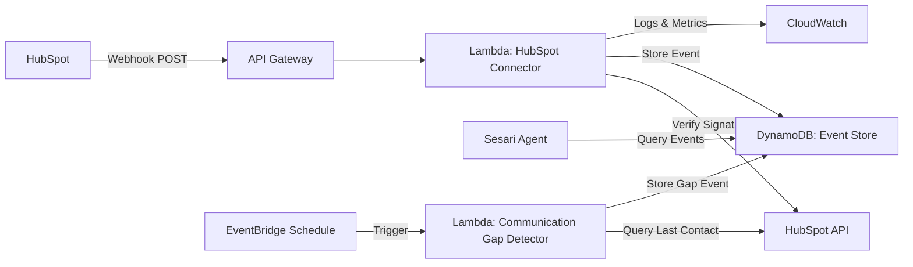

# Design Document: Relationship Senses HubSpot

## Overview

Relationship Senses is a real-time HubSpot monitoring system that detects critical relationship signals for B2B SaaS businesses. The system processes HubSpot webhook events through a serverless Lambda function, extracting deal progression, communication gaps, and customer sentiment to provide the Sesari autonomous growth agent with actionable relationship intelligence.

The design prioritizes AWS Free Tier compliance, security through webhook signature verification, and reliability through idempotent event processing. All relationship signals are persisted in DynamoDB for historical analysis and pattern recognition.

## Architecture

### High-Level Architecture



### Component Responsibilities

**HubSpot Connector Lambda**
- Receives webhook POST requests from HubSpot via API Gateway
- Verifies webhook signatures using HubSpot signing secret
- Parses webhook payloads and extracts relationship signals
- Implements idempotent processing using HubSpot event IDs
- Stores processed events in DynamoDB
- Returns appropriate HTTP status codes for HubSpot retry logic

**Communication Gap Detector Lambda**
- Triggered by EventBridge on a daily schedule
- Queries HubSpot API for deals and contacts
- Calculates days since last communication
- Creates Communication_Gap_Events for relationships exceeding thresholds
- Stores gap events in DynamoDB

**DynamoDB Event Store**
- Persists all relationship signal events (deal progression, communication gaps, sentiment)
- Provides indexed access by company ID and timestamp
- Enforces uniqueness constraints on HubSpot event IDs
- Retains events for 90+ days for trend analysis

**API Gateway**
- Exposes HTTPS endpoint for HubSpot webhooks
- Routes requests to Lambda function
- Handles request/response transformation

### Technology Choices

**AWS Lambda**: Serverless compute eliminates always-on costs and scales automatically with webhook volume. Execution time optimized to stay within 1 million monthly free tier invocations.

**DynamoDB**: Serverless NoSQL database with on-demand pricing scales to zero when idle. Provides fast indexed queries for company-based event retrieval.

**API Gateway**: Managed HTTPS endpoint with automatic SSL certificate management. Free tier includes 1 million API calls per month.

**EventBridge**: Scheduled triggers for communication gap detection. Free tier includes 1 million events per month.

**HubSpot SDK**: Official Node.js SDK for webhook signature verification and API queries. Minimal dependency footprint.

## Components and Interfaces

### HubSpot Connector Lambda

**Entry Point**: `packages/lambdas/hubspot-connector/src/index.ts`

**Handler Function**
```typescript
export async function handler(event: APIGatewayProxyEvent): Promise<APIGatewayProxyResult>
```

**Input**: API Gateway proxy event containing HubSpot webhook payload and headers
**Output**: HTTP response with status code and optional body

**Key Functions**

```typescript
/**
 * Verifies HubSpot webhook signature to ensure authenticity
 */
function verifyWebhookSignature(
  payload: string,
  signature: string,
  secret: string,
  timestamp: string
): boolean

/**
 * Checks if event has already been processed (idempotency)
 */
async function isEventProcessed(eventId: string): Promise<boolean>

/**
 * Extracts relationship signal from HubSpot event based on type
 */
function extractRelationshipSignal(hubspotEvent: HubSpotEvent): RelationshipSignal | null

/**
 * Stores relationship signal in DynamoDB Event Store
 */
async function storeRelationshipSignal(signal: RelationshipSignal): Promise<void>

/**
 * Analyzes text for sentiment indicators
 */
function analyzeSentiment(text: string): SentimentAnalysis
```

### Communication Gap Detector Lambda

**Entry Point**: `packages/lambdas/hubspot-connector/src/gap-detector.ts`

**Handler Function**
```typescript
export async function handler(event: EventBridgeEvent): Promise<void>
```

**Key Functions**

```typescript
/**
 * Retrieves active deals from HubSpot API
 */
async function getActiveDeals(): Promise<HubSpotDeal[]>

/**
 * Retrieves existing customers from HubSpot API
 */
async function getExistingCustomers(): Promise<HubSpotContact[]>

/**
 * Calculates days since last communication for a contact
 */
async function getDaysSinceLastContact(contactId: string): Promise<number>

/**
 * Determines relationship importance based on deal value and stage
 */
function calculateImportanceLevel(
  deal: HubSpotDeal,
  customer: HubSpotContact
): 'high' | 'medium' | 'low'

/**
 * Creates communication gap event if threshold exceeded
 */
async function createGapEventIfNeeded(
  contactId: string,
  companyId: string,
  daysSinceContact: number,
  importance: string
): Promise<void>
```

### Event Store Interface

**DynamoDB Table**: `relationship-signals`

**Primary Key**: `eventId` (HubSpot event ID - ensures uniqueness)
**GSI**: `companyId-timestamp-index` (enables company-based queries)

**Access Functions**

```typescript
/**
 * Stores a relationship signal event in DynamoDB
 */
async function putEvent(event: RelationshipSignalEvent): Promise<void>

/**
 * Checks if an event ID already exists
 */
async function eventExists(eventId: string): Promise<boolean>

/**
 * Retrieves events for a specific company within a date range
 */
async function queryEventsByCompany(
  companyId: string,
  startDate: Date,
  endDate: Date
): Promise<RelationshipSignalEvent[]>

/**
 * Retrieves events by type within a date range
 */
async function queryEventsByType(
  eventType: 'deal_progression' | 'communication_gap' | 'sentiment',
  startDate: Date,
  endDate: Date
): Promise<RelationshipSignalEvent[]>

/**
 * Retrieves events for a specific contact
 */
async function queryEventsByContact(
  contactId: string,
  startDate: Date,
  endDate: Date
): Promise<RelationshipSignalEvent[]>
```

### Configuration Management

**Environment Variables**
- `HUBSPOT_WEBHOOK_SECRET`: Webhook signing secret for signature verification
- `HUBSPOT_API_KEY`: API key for HubSpot API queries (gap detection)
- `DYNAMODB_TABLE_NAME`: Name of the DynamoDB table for event storage
- `AWS_REGION`: AWS region for DynamoDB client
- `LOG_LEVEL`: Logging verbosity (info, warn, error)
- `DEAL_GAP_THRESHOLD_DAYS`: Days before creating gap event for deals (default: 14)
- `CUSTOMER_GAP_THRESHOLD_DAYS`: Days before creating gap event for customers (default: 30)

**Secrets Management**: Webhook signing secret and API key retrieved from environment variables (set via Lambda configuration from AWS Secrets Manager or SSM Parameter Store during deployment).

## Data Models

### RelationshipSignalEvent (DynamoDB Schema)

```typescript
interface RelationshipSignalEvent {
  // Primary Key
  eventId: string;              // HubSpot event ID or generated ID for gap events
  
  // Event Classification
  eventType: 'deal_progression' | 'communication_gap' | 'sentiment';
  
  // Relationship Information
  companyId: string;            // HubSpot company ID
  contactId?: string;           // HubSpot contact ID
  dealId?: string;              // HubSpot deal ID (if applicable)
  
  // Temporal Data
  timestamp: number;            // Unix timestamp (seconds)
  processedAt: number;          // When event was processed by Lambda
  
  // Event-Specific Details
  details: DealProgressionDetails | CommunicationGapDetails | SentimentDetails;
  
  // Metadata
  hubspotEventType?: string;    // Original HubSpot event type
  rawPayload?: string;          // Optional: full HubSpot event for debugging
}
```

### DealProgressionDetails

```typescript
interface DealProgressionDetails {
  oldStage: string;             // Previous deal stage
  newStage: string;             // New deal stage
  isRegression: boolean;        // True if moved backward
  dealValue: number;            // Deal amount
  currency: string;             // ISO currency code
  closeDate?: number;           // Unix timestamp (if closed won)
  dealName: string;             // Deal title
}
```

### CommunicationGapDetails

```typescript
interface CommunicationGapDetails {
  lastCommunicationDate: number;  // Unix timestamp of last contact
  daysSinceLastContact: number;   // Days elapsed
  importanceLevel: 'high' | 'medium' | 'low';
  relationshipType: 'active_deal' | 'existing_customer';
  dealValue?: number;             // If active deal
  customerLifetimeValue?: number; // If existing customer
}
```

### SentimentDetails

```typescript
interface SentimentDetails {
  sentimentScore: number;         // -1.0 (negative) to 1.0 (positive)
  sentimentCategory: 'positive' | 'neutral' | 'negative';
  sourceType: 'note' | 'email' | 'call';
  sourceId: string;               // HubSpot engagement ID
  textExcerpt: string;            // First 200 chars of source text
  keywords: string[];             // Detected sentiment keywords
}
```

### HubSpot Event Type Mapping

**Deal Progression Events**
- `deal.propertyChange`: Detects deal stage changes

**Sentiment Events**
- `engagement.created`: Detects new notes, emails, or calls
- `note.created`: Detects new notes with sentiment

**Communication Gap Events**
- Generated by scheduled Lambda (not webhook-driven)

## Correctness Properties

*A property is a characteristic or behavior that should hold true across all valid executions of a system-essentially, a formal statement about what the system should do. Properties serve as the bridge between human-readable specifications and machine-verifiable correctness guarantees.*

### Property 1: Deal Progression Event Creation (Forward)

*For any* HubSpot deal stage change event where the new stage is more advanced than the old stage, the system should create a Deal_Progression_Event containing the deal ID, company ID, contact ID, old stage, new stage, deal value, and isRegression set to false.

**Validates: Requirements 1.1, 1.4**

### Property 2: Deal Progression Event Creation (Regression)

*For any* HubSpot deal stage change event where the new stage is earlier than the old stage, the system should create a Deal_Progression_Event with isRegression set to true.

**Validates: Requirements 1.2, 1.4**

### Property 3: Closed Won Deal Event

*For any* HubSpot deal marked as "Closed Won", the system should create a Deal_Progression_Event containing the deal value, close date, and new stage "Closed Won".

**Validates: Requirements 1.3, 1.4**

### Property 4: Deal Event Storage Latency

*For any* valid deal progression event, the system should store the event in DynamoDB within 5 seconds of receiving the webhook.

**Validates: Requirements 1.5**

### Property 5: Communication Gap Detection (Active Deals)

*For any* active deal with no logged communication for 14 or more days, the system should create a Communication_Gap_Event containing the contact ID, company ID, last communication date, days since last contact, and importance level.

**Validates: Requirements 2.1, 2.3**

### Property 6: Communication Gap Detection (Existing Customers)

*For any* existing customer with no logged communication for 30 or more days, the system should create a Communication_Gap_Event.

**Validates: Requirements 2.2, 2.3**

### Property 7: Importance Level Calculation

*For any* communication gap event, the importance level should be correctly determined based on deal value, customer lifetime value, or deal stage (high for >$10k deals or high-value customers, medium for $1k-$10k, low for <$1k).

**Validates: Requirements 2.4**

### Property 8: Gap Event Storage Latency

*For any* communication gap detection, the system should store the event in DynamoDB within 5 seconds of detection.

**Validates: Requirements 2.5**

### Property 9: Negative Sentiment Detection

*For any* HubSpot note or email containing negative sentiment indicators (keywords like "frustrated", "disappointed", "cancel", "unhappy"), the system should create a Sentiment_Event marked as negative.

**Validates: Requirements 3.1, 3.3**

### Property 10: Positive Sentiment Detection

*For any* HubSpot note or email containing positive sentiment indicators (keywords like "excited", "love", "great", "expand"), the system should create a Sentiment_Event marked as positive.

**Validates: Requirements 3.2, 3.3**

### Property 11: Sentiment Event Completeness

*For any* sentiment event, the event should include contact ID, company ID, sentiment score, sentiment category, source text excerpt, and timestamp.

**Validates: Requirements 3.3**

### Property 12: Sentiment Categorization

*For any* text analyzed for sentiment, the system should categorize it as positive (score > 0.3), neutral (score -0.3 to 0.3), or negative (score < -0.3) based on keyword analysis.

**Validates: Requirements 3.4**

### Property 13: Sentiment Event Storage Latency

*For any* sentiment detection, the system should store the event in DynamoDB within 5 seconds of receiving the webhook.

**Validates: Requirements 3.5**

### Property 14: Webhook Signature Verification

*For any* incoming webhook request, the system should verify the HubSpot signature using the webhook signing secret, and only process requests with valid signatures.

**Validates: Requirements 4.1**

### Property 15: Invalid Signature Rejection

*For any* webhook request with an invalid signature, the system should return a 401 status code and log a security violation without processing the event.

**Validates: Requirements 4.2**

### Property 16: Replay Attack Prevention

*For any* webhook request with a timestamp older than 5 minutes, the system should reject the request to prevent replay attacks.

**Validates: Requirements 4.3**

### Property 17: Security Failure Logging

*For any* signature verification failure, the system should log the failure with the request source IP address for security monitoring.

**Validates: Requirements 4.5**

### Property 18: Event Persistence

*For any* valid relationship signal event (deal progression, communication gap, or sentiment), the system should successfully persist the event to DynamoDB with all required fields.

**Validates: Requirements 5.1**

### Property 19: Event Query Performance

*For any* query for events by company ID, the system should return results within 200 milliseconds.

**Validates: Requirements 5.3**

### Property 20: Event Retention

*For any* event stored in DynamoDB, the event should be retained for at least 90 days to support trend analysis.

**Validates: Requirements 5.4**

### Property 21: Event Query by Type, Company, Contact, and Date Range

*For any* combination of event type, company ID, contact ID, and date range, querying the Event Store should return only events matching all specified criteria.

**Validates: Requirements 5.5**

### Property 22: Idempotent Event Processing

*For any* HubSpot event ID that has already been processed, receiving a duplicate webhook with the same event ID should return a 200 status code without creating a duplicate event in the Event Store.

**Validates: Requirements 6.1**

### Property 23: Event ID Deduplication

*For any* webhook processing, the system should use the HubSpot event ID as the deduplication key and check for existing events before processing.

**Validates: Requirements 6.2, 6.3**

### Property 24: Event ID Uniqueness

*For any* attempt to store an event with a duplicate HubSpot event ID, the Event Store should enforce uniqueness and prevent duplicate storage.

**Validates: Requirements 6.4**

### Property 25: Duplicate Webhook Logging

*For any* duplicate webhook attempt (same event ID), the system should log the duplicate attempt for monitoring purposes.

**Validates: Requirements 6.5**

### Property 26: Database Unavailability Error Handling

*For any* webhook processing attempt when DynamoDB is unavailable, the system should return a 500 status code to trigger HubSpot's retry mechanism.

**Validates: Requirements 7.1**

### Property 27: Unexpected Error Handling

*For any* unexpected error during webhook processing, the system should log the full error details and return a 500 status code.

**Validates: Requirements 7.2**

### Property 28: Processing Timeout Prevention

*For any* webhook processing, the system should complete within 10 seconds to avoid Lambda timeout.

**Validates: Requirements 7.3**

### Property 29: Malformed Payload Handling

*For any* webhook request with a payload that cannot be parsed as valid JSON, the system should log the raw payload and return a 400 status code.

**Validates: Requirements 7.4**

### Property 30: Exponential Backoff on Write Failures

*For any* DynamoDB write failure, the system should implement exponential backoff with retries before returning an error.

**Validates: Requirements 7.5**

### Property 31: Webhook Processing Logging

*For any* processed webhook, the system should log an entry containing the HubSpot event ID, event type, and processing duration.

**Validates: Requirements 9.1, 9.4**

### Property 32: Metrics Emission

*For any* webhook processing attempt, the system should emit CloudWatch metrics indicating success or failure and processing latency.

**Validates: Requirements 9.2**

### Property 33: Error Context Logging

*For any* processing failure, the system should log the error with sufficient context (event ID, event type, error message, stack trace) for debugging.

**Validates: Requirements 9.3, 9.4**

### Property 34: Processing Time Warning

*For any* webhook processing that exceeds 5 seconds, the system should log a warning.

**Validates: Requirements 9.5**

### Property 35: Relationship Event Type Processing

*For any* HubSpot webhook event of type deal.propertyChange, engagement.created, or note.created, the system should process the event and create the appropriate relationship signal.

**Validates: Requirements 10.1, 10.2, 10.3**

### Property 36: Non-Relationship Event Filtering

*For any* HubSpot webhook event that is not a relationship signal type, the system should return a 200 status code without creating a relationship signal event.

**Validates: Requirements 10.4**

### Property 37: Ignored Event Logging

*For any* ignored webhook event (non-relationship signal type), the system should log the event type for monitoring and potential future expansion.

**Validates: Requirements 10.5**

## Error Handling

### Webhook Signature Verification Errors

**Invalid Signature**
- Return HTTP 401 Unauthorized
- Log security violation with source IP
- Do not process the webhook
- HubSpot will not retry (authentication failure)

**Expired Timestamp (>5 minutes old)**
- Return HTTP 401 Unauthorized
- Log replay attack attempt
- Do not process the webhook

### Parsing Errors

**Malformed JSON Payload**
- Return HTTP 400 Bad Request
- Log raw payload for debugging
- HubSpot will not retry (client error)

**Missing Required Fields**
- Return HTTP 400 Bad Request
- Log validation error with missing fields
- HubSpot will not retry

### Database Errors

**DynamoDB Unavailable**
- Return HTTP 500 Internal Server Error
- Log error with full context
- HubSpot will retry with exponential backoff

**Write Throttling**
- Implement exponential backoff (3 retries)
- If all retries fail, return HTTP 500
- Log throttling event for capacity planning

**Conditional Check Failed (duplicate event ID)**
- Return HTTP 200 OK (idempotent success)
- Log duplicate attempt
- Do not create duplicate event

### Lambda Execution Errors

**Timeout (approaching 10 seconds)**
- Log warning at 8 seconds
- Return HTTP 500 if timeout occurs
- HubSpot will retry

**Out of Memory**
- Log error with memory usage
- Return HTTP 500
- HubSpot will retry

**Unhandled Exception**
- Catch all exceptions at handler level
- Log full error details and stack trace
- Return HTTP 500
- HubSpot will retry

### HubSpot API Errors (Gap Detection)

**Rate Limiting**
- Implement exponential backoff
- Log rate limit event
- Continue processing other contacts

**API Unavailable**
- Log error
- Skip current detection cycle
- Will retry on next scheduled run

**Authentication Failure**
- Log critical error
- Alert operations team
- Skip detection until credentials fixed

### Error Response Format

All error responses follow this structure:

```typescript
{
  statusCode: number,
  body: JSON.stringify({
    error: string,        // Error type
    message: string,      // Human-readable message
    eventId?: string      // HubSpot event ID if available
  })
}
```

### Retry Strategy

**HubSpot's Retry Behavior**
- HubSpot retries webhooks that return 5xx status codes
- Exponential backoff with maximum 10 retry attempts
- 4xx status codes are not retried (client errors)

**Lambda Retry Configuration**
- DynamoDB writes: 3 retries with exponential backoff (100ms, 200ms, 400ms)
- No retries for signature verification (fail fast)
- No retries for parsing errors (fail fast)

**Gap Detection Retry**
- Scheduled daily via EventBridge
- Individual contact failures do not block batch processing
- Failed contacts logged for manual review

## Testing Strategy

### Dual Testing Approach

The testing strategy employs both unit tests and property-based tests to ensure comprehensive coverage:

**Unit Tests**: Focus on specific examples, edge cases, and integration points between components. Unit tests verify concrete scenarios like handling a specific HubSpot event payload or testing error responses for known failure conditions.

**Property-Based Tests**: Verify universal properties across all inputs through randomized testing. Each property test runs a minimum of 100 iterations with randomly generated inputs to catch edge cases that might be missed by example-based tests.

Together, these approaches provide complementary coverage: unit tests catch concrete bugs in specific scenarios, while property tests verify general correctness across the input space.

### Property-Based Testing Configuration

**Framework**: Use `fast-check` for TypeScript/Node.js property-based testing

**Test Configuration**
- Minimum 100 iterations per property test
- Each test references its design document property
- Tag format: `Feature: relationship-senses-hubspot, Property {number}: {property_text}`

**Example Property Test Structure**

```typescript
import fc from 'fast-check';

describe('Feature: relationship-senses-hubspot, Property 1: Deal Progression Event Creation (Forward)', () => {
  it('should create Deal_Progression_Event for any forward stage change', () => {
    fc.assert(
      fc.property(
        fc.record({
          dealId: fc.string(),
          companyId: fc.string(),
          contactId: fc.string(),
          oldStage: fc.constantFrom('Lead', 'Qualified', 'Proposal'),
          newStage: fc.constantFrom('Qualified', 'Proposal', 'Closed Won'),
          dealValue: fc.integer({ min: 0, max: 1000000 })
        }),
        (dealChange) => {
          const event = extractRelationshipSignal(
            createHubSpotEvent('deal.propertyChange', dealChange)
          );
          
          expect(event).toBeDefined();
          expect(event.eventType).toBe('deal_progression');
          expect(event.dealId).toBe(dealChange.dealId);
          expect(event.details.oldStage).toBe(dealChange.oldStage);
          expect(event.details.newStage).toBe(dealChange.newStage);
          expect(event.details.isRegression).toBe(false);
        }
      ),
      { numRuns: 100 }
    );
  });
});
```

### Unit Testing Focus Areas

**Specific Examples**
- Test processing a real HubSpot webhook payload from documentation
- Test handling a deal moving from "Qualified" to "Proposal"
- Test processing a note with text "Customer is frustrated with the product"

**Edge Cases**
- Empty webhook payload
- Webhook with missing company ID
- Deal stage change with no actual change (same stage)
- Note with no sentiment keywords
- Communication gap exactly at 14-day threshold

**Integration Points**
- DynamoDB connection and error handling
- HubSpot SDK signature verification
- HubSpot API queries for gap detection
- CloudWatch logging and metrics emission
- Environment variable configuration

**Error Conditions**
- Invalid signature verification
- DynamoDB throttling
- Lambda timeout scenarios
- Malformed JSON payloads
- HubSpot API rate limiting

### Test Coverage Requirements

**Minimum Coverage Targets**
- Line coverage: 90%
- Branch coverage: 85%
- Function coverage: 100%

**Critical Paths (100% coverage required)**
- Webhook signature verification
- Event ID deduplication logic
- Relationship signal extraction
- Sentiment analysis
- Error handling and status code returns

### Testing Tools

**Unit Testing**: Vitest with TypeScript support
**Property Testing**: fast-check
**Mocking**: AWS SDK mocks for DynamoDB, HubSpot API mocks
**Integration Testing**: LocalStack for local AWS service testing

### Continuous Integration

All tests must pass before deployment:
- Unit tests run on every commit
- Property tests run on every pull request
- Integration tests run before production deployment
- Coverage reports generated and tracked over time

## AWS Free Tier Optimization

### Lambda Configuration

**HubSpot Connector Lambda**
- Memory: 512 MB (balance between cost and performance)
- Timeout: 10 seconds (sufficient for webhook processing)
- Concurrency: No reserved concurrency (use on-demand)

**Communication Gap Detector Lambda**
- Memory: 1024 MB (needs more memory for API queries)
- Timeout: 5 minutes (batch processing of contacts)
- Concurrency: 1 (prevent overlapping runs)

### Cost Optimization Strategies

**Webhook Processing**
- Minimize cold start time with small dependency footprint
- Process only relevant event types (filter early)
- Use efficient DynamoDB queries with GSI

**Gap Detection**
- Run once daily (not hourly) to minimize invocations
- Batch process contacts to reduce API calls
- Cache HubSpot API responses within execution

**DynamoDB**
- Use on-demand pricing (no provisioned capacity)
- Implement efficient query patterns with GSI
- Set TTL for automatic event expiration after 90 days

### Cost Estimates (Free Tier)

**Lambda Invocations**
- Webhook processing: ~1000 webhooks/month = well within 1M free tier
- Gap detection: 30 runs/month = negligible

**DynamoDB**
- Storage: ~1GB for 90 days of events = within 25GB free tier
- Reads/Writes: ~10k operations/month = within free tier

**API Gateway**
- Requests: ~1000/month = well within 1M free tier

**Expected monthly cost**: <$1 for typical usage

## Deployment Architecture

### Infrastructure Components

**API Gateway**
- REST API with POST endpoint `/hubspot-webhook`
- Integration with HubSpot Connector Lambda
- Request validation and transformation

**Lambda Functions**
- `hubspot-connector`: Webhook processing
- `communication-gap-detector`: Scheduled gap detection

**DynamoDB Table**
- Table name: `relationship-signals`
- Primary key: `eventId` (String)
- GSI: `companyId-timestamp-index`
- TTL attribute: `expiresAt` (90 days)

**EventBridge Rule**
- Schedule: `cron(0 9 * * ? *)` (daily at 9 AM UTC)
- Target: Communication Gap Detector Lambda

**IAM Roles**
- Lambda execution role with DynamoDB read/write permissions
- Lambda execution role with HubSpot API access (for gap detector)
- CloudWatch Logs permissions

### Environment Configuration

**Secrets Management**
- Store `HUBSPOT_WEBHOOK_SECRET` in AWS Secrets Manager
- Store `HUBSPOT_API_KEY` in AWS Secrets Manager
- Lambda retrieves secrets at startup

**Configuration Parameters**
- Store thresholds in SSM Parameter Store
- Allow runtime configuration without redeployment

### Monitoring and Alerting

**CloudWatch Alarms**
- Lambda error rate > 5%
- Lambda duration > 8 seconds
- DynamoDB throttling events
- Signature verification failures > 10/hour

**CloudWatch Dashboards**
- Webhook processing metrics
- Gap detection metrics
- Event type distribution
- Processing latency trends

**Log Aggregation**
- Structured JSON logging
- Correlation IDs for request tracing
- Log retention: 30 days
