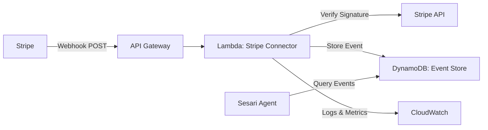

# Design Document: Revenue Senses Stripe

## Overview

Revenue Senses is a real-time Stripe monitoring system that detects critical revenue signals for B2B SaaS businesses. The system processes Stripe webhook events through a serverless Lambda function, extracting expansion opportunities, churn risks, and payment failures to provide the Sesari autonomous growth agent with actionable revenue intelligence.

The design prioritizes AWS Free Tier compliance, security through webhook signature verification, and reliability through idempotent event processing. All revenue signals are persisted in DynamoDB for historical analysis and pattern recognition.

## Architecture

### High-Level Architecture



### Component Responsibilities

**Stripe Connector Lambda**
- Receives webhook POST requests from Stripe via API Gateway
- Verifies webhook signatures using Stripe signing secret
- Parses webhook payloads and extracts revenue signals
- Implements idempotent processing using Stripe event IDs
- Stores processed events in DynamoDB
- Returns appropriate HTTP status codes for Stripe retry logic

**DynamoDB Event Store**
- Persists all revenue signal events (expansion, churn, failed payments)
- Provides indexed access by customer ID and timestamp
- Enforces uniqueness constraints on Stripe event IDs
- Retains events for 90+ days for trend analysis

**API Gateway**
- Exposes HTTPS endpoint for Stripe webhooks
- Routes requests to Lambda function
- Handles request/response transformation

### Technology Choices

**AWS Lambda**: Serverless compute eliminates always-on costs and scales automatically with webhook volume. Execution time optimized to stay within 1 million monthly free tier invocations.

**DynamoDB**: Serverless NoSQL database with on-demand pricing scales to zero when idle. Provides fast indexed queries for customer-based event retrieval.

**API Gateway**: Managed HTTPS endpoint with automatic SSL certificate management. Free tier includes 1 million API calls per month.

**Stripe SDK**: Official Node.js SDK for webhook signature verification and event parsing. Minimal dependency footprint.

## Components and Interfaces

### Stripe Connector Lambda

**Entry Point**: `packages/lambdas/stripe-connector/src/index.ts`

**Handler Function**
```typescript
export async function handler(event: APIGatewayProxyEvent): Promise<APIGatewayProxyResult>
```

**Input**: API Gateway proxy event containing Stripe webhook payload and headers
**Output**: HTTP response with status code and optional body

**Key Functions**

```typescript
/**
 * Verifies Stripe webhook signature to ensure authenticity
 */
function verifyWebhookSignature(
  payload: string,
  signature: string,
  secret: string
): boolean

/**
 * Checks if event has already been processed (idempotency)
 */
async function isEventProcessed(eventId: string): Promise<boolean>

/**
 * Extracts revenue signal from Stripe event based on type
 */
function extractRevenueSignal(stripeEvent: Stripe.Event): RevenueSignal | null

/**
 * Stores revenue signal in DynamoDB Event Store
 */
async function storeRevenueSignal(signal: RevenueSignal): Promise<void>
```

### Event Store Interface

**DynamoDB Table**: `revenue-signals`

**Primary Key**: `eventId` (Stripe event ID - ensures uniqueness)
**GSI**: `customerId-timestamp-index` (enables customer-based queries)

**Access Functions**

```typescript
/**
 * Stores a revenue signal event in DynamoDB
 */
async function putEvent(event: RevenueSignalEvent): Promise<void>

/**
 * Checks if an event ID already exists
 */
async function eventExists(eventId: string): Promise<boolean>

/**
 * Retrieves events for a specific customer within a date range
 */
async function queryEventsByCustomer(
  customerId: string,
  startDate: Date,
  endDate: Date
): Promise<RevenueSignalEvent[]>

/**
 * Retrieves events by type within a date range
 */
async function queryEventsByType(
  eventType: 'expansion' | 'churn' | 'failed_payment',
  startDate: Date,
  endDate: Date
): Promise<RevenueSignalEvent[]>
```

### Configuration Management

**Environment Variables**
- `STRIPE_WEBHOOK_SECRET`: Webhook signing secret for signature verification
- `DYNAMODB_TABLE_NAME`: Name of the DynamoDB table for event storage
- `AWS_REGION`: AWS region for DynamoDB client
- `LOG_LEVEL`: Logging verbosity (info, warn, error)

**Secrets Management**: Webhook signing secret retrieved from environment variables (set via Lambda configuration from AWS Secrets Manager or SSM Parameter Store during deployment).

## Data Models

### RevenueSignalEvent (DynamoDB Schema)

```typescript
interface RevenueSignalEvent {
  // Primary Key
  eventId: string;              // Stripe event ID (e.g., "evt_1234...")
  
  // Event Classification
  eventType: 'expansion' | 'churn' | 'failed_payment';
  
  // Customer Information
  customerId: string;           // Stripe customer ID
  subscriptionId?: string;      // Stripe subscription ID (if applicable)
  
  // Temporal Data
  timestamp: number;            // Unix timestamp (seconds)
  processedAt: number;          // When event was processed by Lambda
  
  // Revenue Impact
  revenueImpact: {
    oldMrr?: number;           // Previous monthly recurring revenue
    newMrr?: number;           // New monthly recurring revenue
    amount?: number;           // Transaction amount (for failed payments)
    currency: string;          // ISO currency code (e.g., "usd")
  };
  
  // Event-Specific Details
  details: ExpansionDetails | ChurnDetails | FailedPaymentDetails;
  
  // Metadata
  stripeEventType: string;     // Original Stripe event type
  rawPayload?: string;         // Optional: full Stripe event for debugging
}
```

### ExpansionDetails

```typescript
interface ExpansionDetails {
  changeType: 'plan_upgrade' | 'quantity_increase' | 'additional_product';
  oldPlanId?: string;
  newPlanId?: string;
  oldQuantity?: number;
  newQuantity?: number;
  additionalProducts?: string[];
}
```

### ChurnDetails

```typescript
interface ChurnDetails {
  cancellationType: 'immediate' | 'end_of_period';
  cancellationReason?: string;
  canceledAt: number;          // Unix timestamp
  endsAt?: number;             // When subscription actually ends
  mrrLost: number;
}
```

### FailedPaymentDetails

```typescript
interface FailedPaymentDetails {
  failureReason: string;
  failureCode: string;
  failureCategory: 'card_declined' | 'expired_card' | 'insufficient_funds' | 'other';
  attemptCount: number;        // Which retry attempt this represents
  nextRetryAt?: number;        // When Stripe will retry (if applicable)
}
```

### Stripe Event Type Mapping

**Expansion Events**
- `customer.subscription.updated`: Detects plan upgrades and quantity increases
- `customer.subscription.created`: Detects new subscriptions (potential expansion from free tier)

**Churn Events**
- `customer.subscription.deleted`: Subscription canceled

**Failed Payment Events**
- `invoice.payment_failed`: Payment attempt failed


## Correctness Properties

*A property is a characteristic or behavior that should hold true across all valid executions of a system-essentially, a formal statement about what the system should do. Properties serve as the bridge between human-readable specifications and machine-verifiable correctness guarantees.*

### Property 1: Expansion Event Creation

*For any* Stripe subscription update event that represents a plan upgrade, quantity increase, or additional product, the system should create an Expansion_Event containing the customer ID, old MRR, new MRR, and change details.

**Validates: Requirements 1.1, 1.2, 1.3, 1.4**

### Property 2: Churn Event Creation

*For any* Stripe subscription cancellation or deletion event, the system should create a Churn_Event containing the customer ID, subscription ID, cancellation timestamp, MRR lost, cancellation reason (if provided), and correct cancellation type (immediate or end_of_period).

**Validates: Requirements 2.1, 2.2, 2.3, 2.5**

### Property 3: Failed Payment Event Creation

*For any* Stripe invoice payment failure event, the system should create a Failed_Payment_Event containing the customer ID, subscription ID, failure timestamp, payment amount, failure code, and correctly categorized failure reason (card_declined, expired_card, insufficient_funds, or other).

**Validates: Requirements 3.1, 3.2, 3.3**

### Property 4: Multiple Payment Failures

*For any* subscription with multiple payment retry failures, each failure should result in a separate Failed_Payment_Event with the correct attempt count.

**Validates: Requirements 3.5**

### Property 5: Webhook Signature Verification

*For any* incoming webhook request, the system should verify the Stripe signature using the webhook signing secret, and only process requests with valid signatures.

**Validates: Requirements 4.1**

### Property 6: Invalid Signature Rejection

*For any* webhook request with an invalid signature, the system should return a 401 status code and log a security violation without processing the event.

**Validates: Requirements 4.2**

### Property 7: Replay Attack Prevention

*For any* webhook request with a timestamp older than 5 minutes, the system should reject the request to prevent replay attacks.

**Validates: Requirements 4.3**

### Property 8: Security Failure Logging

*For any* signature verification failure, the system should log the failure with the request source IP address for security monitoring.

**Validates: Requirements 4.5**

### Property 9: Event Persistence

*For any* valid revenue signal event (expansion, churn, or failed payment), the system should successfully persist the event to DynamoDB with all required fields.

**Validates: Requirements 5.1**

### Property 10: Event Query by Customer and Date Range

*For any* customer ID and date range, querying the Event Store should return all events for that customer within the specified date range, ordered by timestamp.

**Validates: Requirements 5.5**

### Property 11: Event Query by Type

*For any* event type (expansion, churn, failed_payment) and date range, querying the Event Store should return only events of that type within the specified date range.

**Validates: Requirements 5.5**

### Property 12: Idempotent Event Processing

*For any* Stripe event ID that has already been processed, receiving a duplicate webhook with the same event ID should return a 200 status code without creating a duplicate event in the Event Store.

**Validates: Requirements 6.1**

### Property 13: Event ID Uniqueness

*For any* attempt to store an event with a duplicate Stripe event ID, the Event Store should enforce uniqueness and prevent duplicate storage.

**Validates: Requirements 6.4**

### Property 14: Duplicate Webhook Logging

*For any* duplicate webhook attempt (same event ID), the system should log the duplicate attempt for monitoring purposes.

**Validates: Requirements 6.5**

### Property 15: Database Unavailability Error Handling

*For any* webhook processing attempt when DynamoDB is unavailable, the system should return a 500 status code to trigger Stripe's retry mechanism.

**Validates: Requirements 7.1**

### Property 16: Unexpected Error Handling

*For any* unexpected error during webhook processing, the system should log the full error details and return a 500 status code.

**Validates: Requirements 7.2**

### Property 17: Malformed Payload Handling

*For any* webhook request with a payload that cannot be parsed as valid JSON, the system should log the raw payload and return a 400 status code.

**Validates: Requirements 7.4**

### Property 18: Webhook Processing Logging

*For any* processed webhook, the system should log an entry containing the Stripe event ID, event type, and processing duration.

**Validates: Requirements 9.1, 9.4**

### Property 19: Metrics Emission

*For any* webhook processing attempt, the system should emit CloudWatch metrics indicating success or failure and processing latency.

**Validates: Requirements 9.2**

### Property 20: Error Context Logging

*For any* processing failure, the system should log the error with sufficient context (event ID, event type, error message, stack trace) for debugging.

**Validates: Requirements 9.3, 9.4**

### Property 21: Revenue Event Type Processing

*For any* Stripe webhook event of type customer.subscription.updated, customer.subscription.deleted, or invoice.payment_failed, the system should process the event and create the appropriate revenue signal.

**Validates: Requirements 10.1, 10.2, 10.3**

### Property 22: Non-Revenue Event Filtering

*For any* Stripe webhook event that is not a revenue signal type (not subscription.updated, subscription.deleted, or payment_failed), the system should return a 200 status code without creating a revenue signal event.

**Validates: Requirements 10.4**

### Property 23: Ignored Event Logging

*For any* ignored webhook event (non-revenue signal type), the system should log the event type for monitoring and potential future expansion.

**Validates: Requirements 10.5**

## Error Handling

### Webhook Signature Verification Errors

**Invalid Signature**
- Return HTTP 401 Unauthorized
- Log security violation with source IP
- Do not process the webhook
- Stripe will not retry (authentication failure)

**Expired Timestamp (>5 minutes old)**
- Return HTTP 401 Unauthorized
- Log replay attack attempt
- Do not process the webhook

### Parsing Errors

**Malformed JSON Payload**
- Return HTTP 400 Bad Request
- Log raw payload for debugging
- Stripe will not retry (client error)

**Missing Required Fields**
- Return HTTP 400 Bad Request
- Log validation error with missing fields
- Stripe will not retry

### Database Errors

**DynamoDB Unavailable**
- Return HTTP 500 Internal Server Error
- Log error with full context
- Stripe will retry with exponential backoff

**Write Throttling**
- Implement exponential backoff (3 retries)
- If all retries fail, return HTTP 500
- Log throttling event for capacity planning

**Conditional Check Failed (duplicate event ID)**
- Return HTTP 200 OK (idempotent success)
- Log duplicate attempt
- Do not create duplicate event

### Lambda Execution Errors

**Timeout (approaching 10 seconds)**
- Log warning at 8 seconds
- Return HTTP 500 if timeout occurs
- Stripe will retry

**Out of Memory**
- Log error with memory usage
- Return HTTP 500
- Stripe will retry

**Unhandled Exception**
- Catch all exceptions at handler level
- Log full error details and stack trace
- Return HTTP 500
- Stripe will retry

### Error Response Format

All error responses follow this structure:

```typescript
{
  statusCode: number,
  body: JSON.stringify({
    error: string,        // Error type
    message: string,      // Human-readable message
    eventId?: string      // Stripe event ID if available
  })
}
```

### Retry Strategy

**Stripe's Retry Behavior**
- Stripe retries webhooks that return 5xx status codes
- Exponential backoff: immediate, 1 hour, 3 hours, 6 hours, 12 hours, 24 hours
- Maximum 3 days of retries
- 4xx status codes are not retried (client errors)

**Lambda Retry Configuration**
- DynamoDB writes: 3 retries with exponential backoff (100ms, 200ms, 400ms)
- No retries for signature verification (fail fast)
- No retries for parsing errors (fail fast)

## Testing Strategy

### Dual Testing Approach

The testing strategy employs both unit tests and property-based tests to ensure comprehensive coverage:

**Unit Tests**: Focus on specific examples, edge cases, and integration points between components. Unit tests verify concrete scenarios like handling a specific Stripe event payload or testing error responses for known failure conditions.

**Property-Based Tests**: Verify universal properties across all inputs through randomized testing. Each property test runs a minimum of 100 iterations with randomly generated inputs to catch edge cases that might be missed by example-based tests.

Together, these approaches provide complementary coverage: unit tests catch concrete bugs in specific scenarios, while property tests verify general correctness across the input space.

### Property-Based Testing Configuration

**Framework**: Use `fast-check` for TypeScript/Node.js property-based testing

**Test Configuration**
- Minimum 100 iterations per property test
- Each test references its design document property
- Tag format: `Feature: revenue-senses-stripe, Property {number}: {property_text}`

**Example Property Test Structure**

```typescript
import fc from 'fast-check';

describe('Feature: revenue-senses-stripe, Property 1: Expansion Event Creation', () => {
  it('should create Expansion_Event for any subscription upgrade', () => {
    fc.assert(
      fc.property(
        fc.record({
          customerId: fc.string(),
          oldPlanId: fc.string(),
          newPlanId: fc.string(),
          oldMrr: fc.integer({ min: 0, max: 100000 }),
          newMrr: fc.integer({ min: 0, max: 100000 })
        }),
        (subscriptionUpdate) => {
          const event = extractRevenueSignal(
            createStripeEvent('customer.subscription.updated', subscriptionUpdate)
          );
          
          expect(event).toBeDefined();
          expect(event.eventType).toBe('expansion');
          expect(event.customerId).toBe(subscriptionUpdate.customerId);
          expect(event.revenueImpact.oldMrr).toBe(subscriptionUpdate.oldMrr);
          expect(event.revenueImpact.newMrr).toBe(subscriptionUpdate.newMrr);
        }
      ),
      { numRuns: 100 }
    );
  });
});
```

### Unit Testing Focus Areas

**Specific Examples**
- Test processing a real Stripe webhook payload from documentation
- Test handling a subscription upgrade from $99/mo to $199/mo
- Test processing a cancellation with reason "too_expensive"

**Edge Cases**
- Empty webhook payload
- Webhook with missing customer ID
- Subscription update with no MRR change (should not create expansion event)
- Payment failure with unknown failure code
- Event with timestamp exactly at 5-minute boundary

**Integration Points**
- DynamoDB connection and error handling
- Stripe SDK signature verification
- CloudWatch logging and metrics emission
- Environment variable configuration

**Error Conditions**
- Invalid signature verification
- DynamoDB throttling
- Lambda timeout scenarios
- Malformed JSON payloads

### Test Coverage Requirements

**Minimum Coverage Targets**
- Line coverage: 90%
- Branch coverage: 85%
- Function coverage: 100%

**Critical Paths (100% coverage required)**
- Webhook signature verification
- Event ID deduplication logic
- Revenue signal extraction
- Error handling and status code returns

### Testing Tools

**Unit Testing**: Vitest with TypeScript support
**Property Testing**: fast-check
**Mocking**: AWS SDK mocks for DynamoDB
**Integration Testing**: LocalStack for local AWS service testing

### Continuous Integration

All tests must pass before deployment:
- Unit tests run on every commit
- Property tests run on every pull request
- Integration tests run before production deployment
- Coverage reports generated and tracked over time
